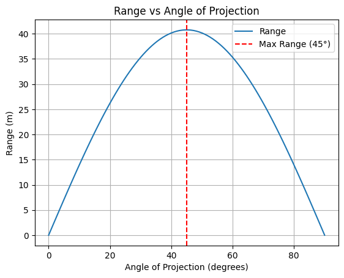
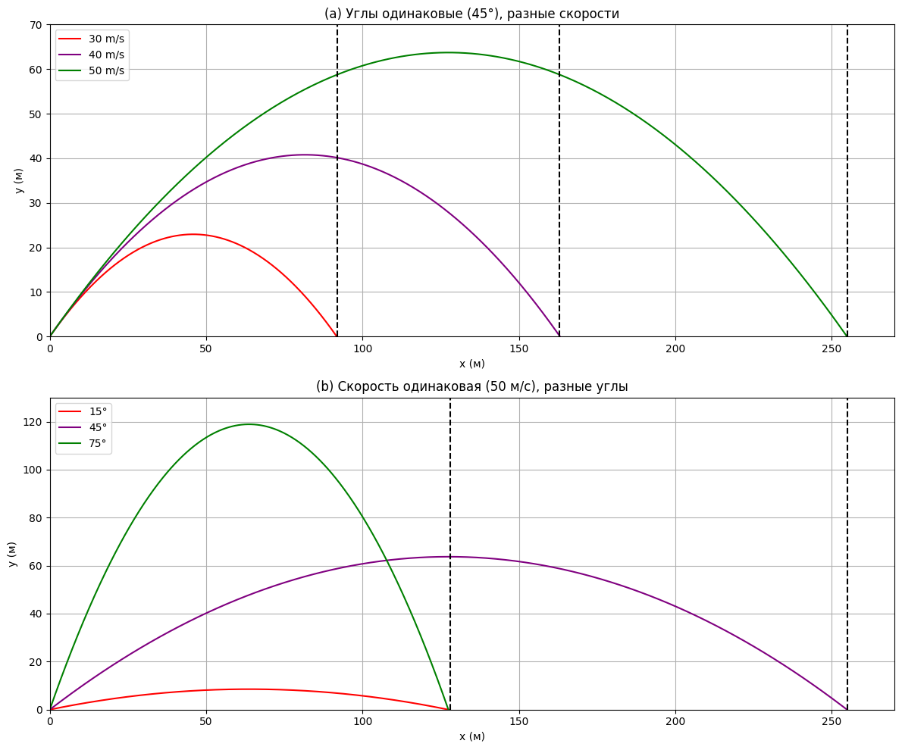

# Problem 1

# 📌 *Mechanics: Investigating the Range as a Function of the Angle of Projection*  

## 🏹 *Motivation*  

Projectile motion appears simple, yet it encapsulates deep physical principles. By analyzing how the range of a projectile varies with its launch angle, we uncover fascinating relationships governed by linear and quadratic equations. These equations have broad applications, from sports (e.g., the trajectory of a soccer ball) to engineering (e.g., missile launch dynamics).  

---

## ⚖ *1. Theoretical Foundation*  

### 📜 *Equations of Motion*  

A projectile launched with an initial velocity \( v_0 \) at an angle \( \theta \) follows a *parabolic* trajectory under the influence of gravity. We derive its motion using Newton's laws.

#### 🔹 *Horizontal Motion*
Since there is no acceleration in the horizontal direction (assuming no air resistance), the velocity remains constant

\[
x(t) = v_0 \cos\theta \cdot t
\]

#### 🔹 *Vertical Motion*
The vertical motion is governed by constant acceleration due to gravity \( g \):

\[
y(t) = v_0 \sin\theta \cdot t - \frac{1}{2} g t^2
\]

The projectile reaches the ground when \( y = 0 \), solving for \( t \):

\[
t_f = \frac{2 v_0 \sin\theta}{g}
\]

This is the total *time of flight*.

---

## 📏 *2. Analysis of the Range*  

The *range* \( R \) is the horizontal distance covered by the projectile when it lands:

\[
R = x(t_f) = v_0 \cos\theta \cdot \frac{2 v_0 \sin\theta}{g}
\]

Using the identity \( 2\sin\theta\cos\theta = \sin 2\theta \), we get:

\[
R = \frac{v_0^2}{g} \sin 2\theta
\]

### 📌 *Key Observations:*
1. *Maximum Range:*  
   The range is maximized when \( \sin 2\theta = 1 \), i.e., \( 2\theta = 90^\circ \) → *\( \theta = 45^\circ \)*.

2. *Symmetry:*  
   The function \( R(\theta) \) is *symmetric* around \( 45^\circ \), meaning \( R(\theta) = R(90^\circ - \theta) \).

3. *Effect of Initial Velocity:*  
   Since \( R \propto v_0^2 \), doubling \( v_0 \) quadruples the range.

4. *Effect of Gravity:*  
   Since \( R \propto \frac{1}{g} \), projectiles travel *farther* on planets with lower gravity (e.g., the Moon).  

---

## 🌎 *3. Practical Applications*  

1. *Sports:*  
   - Soccer: Kicking a ball at \( 45^\circ \) for maximum distance.  
   - Basketball: Analyzing the optimal shooting angle.  

2. *Engineering & Ballistics:*  
   - Missile trajectories and range optimization.  
   - Water fountains and fluid mechanics.  

3. *Astrophysics:*  
   - Moon landings require adjusting launch angles based on gravity.  

---

## 💻 *4. Implementation (Python Simulation)*  

### 🔹 Graph Interpretation
- The *maximum range* occurs at **θ = 45°**  
- The function is *symmetric* about **45°**  
- Higher **v₀** increases range *quadratically*

---

### 🔹 Limitations of the Model
- Assumes **no air resistance**
- Assumes **flat terrain** (ignores hills, obstacles)
- Ignores **wind effects**, which can alter trajectories

---

### 🔹 Enhancements
- Add **air drag** to create more realistic simulations
- Consider launches from **elevated platforms** (e.g., artillery firing from a hill)
 




[Visit Collab link](https://colab.research.google.com/drive/15aipIXpntUFvD30gQxap78OZghCNOeKy)

``` python
import numpy as np
import matplotlib.pyplot as plt

# Gravitational acceleration
g = 9.81

# Function to plot the trajectory
def trajectory(v0, angle_deg):
    angle_rad = np.radians(angle_deg)
    t_flight = 2 * v0 * np.sin(angle_rad) / g
    t = np.linspace(0, t_flight, num=500)
    x = v0 * np.cos(angle_rad) * t
    y = v0 * np.sin(angle_rad) * t - 0.5 * g * t**2
    return x, y

# Graph (a)
plt.figure(figsize=(12, 10))
plt.subplot(2, 1, 1)
for v0, color in zip([30, 40, 50], ['red', 'purple', 'green']):
    x, y = trajectory(v0, 45)
    plt.plot(x, y, color=color, label=f'{v0} m/s')
plt.title('(a) Same angle (45°), different speeds')
plt.xlabel('x (m)')
plt.ylabel('y (m)')
plt.grid(True)
plt.legend()
plt.axvline(91.8, color='black', linestyle='--')
plt.axvline(163, color='black', linestyle='--')
plt.axvline(255, color='black', linestyle='--')
plt.xlim(0, 270)
plt.ylim(0, 70)

# Graph (b)
plt.subplot(2, 1, 2)
v0 = 50
for angle, color in zip([15, 45, 75], ['red', 'purple', 'green']):
    x, y = trajectory(v0, angle)
    plt.plot(x, y, color=color, label=f'{angle}°')
plt.title('(b) Same speed (50 m/s), different angles')
plt.xlabel('x (m)')
plt.ylabel('y (m)')
plt.grid(True)
plt.legend()
plt.axvline(128, color='black', linestyle='--')
plt.axvline(255, color='black', linestyle='--')
plt.xlim(0, 270)
plt.ylim(0, 130)

plt.tight_layout()
plt.show()
```
---
  


# 🎯 Projectile Motion Analysis

## 📊 Graph (a): Different Initial Speeds, Same Angle (45°)

**Launch angle:** `45°` — this is the optimal angle for achieving maximum range when the initial speed is fixed.

**Initial speeds:**
- `30 m/s` (🔴 red trajectory)  
- `40 m/s` (🟣 purple trajectory)  
- `50 m/s` (🟢 green trajectory)  

**Conclusion:** The greater the initial speed (with a fixed angle), the farther the projectile travels.

**Example ranges (R):**
- `30 m/s` → `R ≈ 91.8 m`
- `40 m/s` → `R ≈ 163 m`
- `50 m/s` → `R ≈ 255 m`

### 📌 Range formula:

R = (v₀² * sin(2θ)) / g

When `θ = 45°`, `sin(2θ) = sin(90°) = 1` → So the range depends only on `v₀²`.

---

## 📊 Graph (b): Same Initial Speed (50 m/s), Different Angles

**Initial speed:** `50 m/s` for all three trajectories.

**Angles:**
- `15°` (🔴 red): low trajectory, small height and short range.
- `45°` (🟣 purple): maximum range.
- `75°` (🟢 green): high trajectory, but shorter range.

**Interesting fact:** `15°` and `75°` give equal range (`R ≈ 128 m`), even though the shapes of the trajectories are very different.

### 📌 Symmetry Law:
Angles `θ` and `90° − θ` give the same range, because:  

sin(2θ) = sin(2(90° − θ)) = sin(180° − 2θ) = sin(2θ)

---

## 🧠 Main Takeaways:
- The best angle for maximum range with a given speed is `45°`.
- With the same angle, higher speed means greater range.
- Angles that add up to `90°` (like `15°` and `75°`) give the same range, but different heights and flight paths.




[Visit Collab link](https://colab.research.google.com/drive/14BpYdqwbOn7Z3weu4Y97IEqOdFX3yg9F)

``` python
import numpy as np
import matplotlib.pyplot as plt

# Gravitational acceleration
g = 9.81

# Function to plot the trajectory
def trajectory(v0, angle_deg):
    angle_rad = np.radians(angle_deg)
    t_flight = 2 * v0 * np.sin(angle_rad) / g
    t = np.linspace(0, t_flight, num=500)
    x = v0 * np.cos(angle_rad) * t
    y = v0 * np.sin(angle_rad) * t - 0.5 * g * t**2
    return x, y

# Graph (a)
plt.figure(figsize=(12, 10))
plt.subplot(2, 1, 1)
for v0, color in zip([30, 40, 50], ['red', 'purple', 'green']):
    x, y = trajectory(v0, 45)
    plt.plot(x, y, color=color, label=f'{v0} m/s')
plt.title('(a) Same angle (45°), different speeds')
plt.xlabel('x (m)')
plt.ylabel('y (m)')
plt.grid(True)
plt.legend()
plt.axvline(91.8, color='black', linestyle='--')
plt.axvline(163, color='black', linestyle='--')
plt.axvline(255, color='black', linestyle='--')
plt.xlim(0, 270)
plt.ylim(0, 70)

# Graph (b)
plt.subplot(2, 1, 2)
v0 = 50
for angle, color in zip([15, 45, 75], ['red', 'purple', 'green']):
    x, y = trajectory(v0, angle)
    plt.plot(x, y, color=color, label=f'{angle}°')
plt.title('(b) Same speed (50 m/s), different angles')
plt.xlabel('x (m)')
plt.ylabel('y (m)')
plt.grid(True)
plt.legend()
plt.axvline(128, color='black', linestyle='--')
plt.axvline(255, color='black', linestyle='--')
plt.xlim(0, 270)
plt.ylim(0, 130)

plt.tight_layout()
plt.show()
```