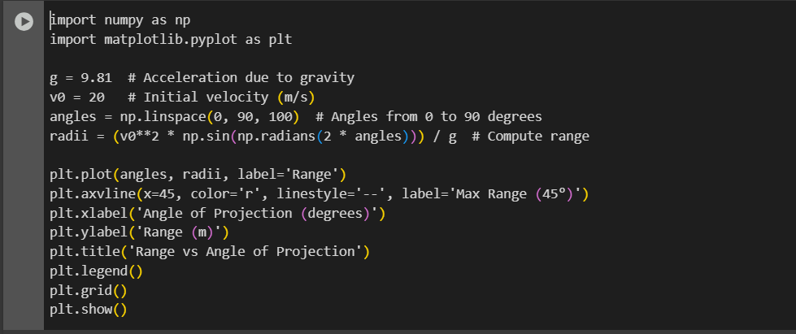

# Problem 1

# 📌 *Mechanics: Investigating the Range as a Function of the Angle of Projection*  

## 🏹 *Motivation*  

Projectile motion appears simple, yet it encapsulates deep physical principles. By analyzing how the range of a projectile varies with its launch angle, we uncover fascinating relationships governed by linear and quadratic equations. These equations have broad applications, from sports (e.g., the trajectory of a soccer ball) to engineering (e.g., missile launch dynamics)   

---

## ⚖ *1. Theoretical Foundation*  

### 📜 *Equations of Motion*  

A projectile launched with an initial velocity \( v_0 \) at an angle \( \theta \) follows a *parabolic* trajectory under the influence of gravity. We derive its motion using Newton's laws.

#### 🔹 *Horizontal Motion*
Since there is no acceleration in the horizontal direction (assuming no air resistance), the velocity remains constant:

\[
x(t) = v_0 \cos\theta \cdot t
\]

#### 🔹 *Vertical Motion*
The vertical motion is governed by constant acceleration due to gravity \( g \):

\[
y(t) = v_0 \sin\theta \cdot t - \frac{1}{2} g t^2
\]

The projectile reaches the ground when \( y = 0 \), solving for \( t \):

\[
t_f = \frac{2 v_0 \sin\theta}{g}
\]

This is the total *time of flight*.

---

## 📏 *2. Analysis of the Range*  

The *range* \( R \) is the horizontal distance covered by the projectile when it lands:

\[
R = x(t_f) = v_0 \cos\theta \cdot \frac{2 v_0 \sin\theta}{g}
\]

Using the identity \( 2\sin\theta\cos\theta = \sin 2\theta \), we get:

\[
R = \frac{v_0^2}{g} \sin 2\theta
\]

### 📌 *Key Observations:*
1. *Maximum Range:*  
   The range is maximized when \( \sin 2\theta = 1 \), i.e., \( 2\theta = 90^\circ \) → *\( \theta = 45^\circ \)*.

2. *Symmetry:*  
   The function \( R(\theta) \) is *symmetric* around \( 45^\circ \), meaning \( R(\theta) = R(90^\circ - \theta) \).

3. *Effect of Initial Velocity:*  
   Since \( R \propto v_0^2 \), doubling \( v_0 \) quadruples the range.

4. *Effect of Gravity:*  
   Since \( R \propto \frac{1}{g} \), projectiles travel *farther* on planets with lower gravity (e.g., the Moon).  

---

## 🌎 *3. Practical Applications*  

1. *Sports:*  
   - Soccer: Kicking a ball at \( 45^\circ \) for maximum distance.  
   - Basketball: Analyzing the optimal shooting angle.  

2. *Engineering & Ballistics:*  
   - Missile trajectories and range optimization.  
   - Water fountains and fluid mechanics.  

3. *Astrophysics:*  
   - Moon landings require adjusting launch angles based on gravity.  

---

## 💻 *4. Implementation (Python Simulation)*  

Below is a Python script to simulate the projectile range as a function of \( \theta \):

https://colab.research.google.com/drive/15aipIXpntUFvD30gQxap78OZghCNOeKy

## 📊 *5. Results and Discussion*  

### 🔹 *Graph Interpretation*
- The *maximum range* occurs at \( \theta = 45^\circ \).  
- The function is *symmetric* about \( 45^\circ \).  
- Higher \( v_0 \) increases range quadratically.  

### 🔹 *Limitations of the Model*
- Assumes *no air resistance*.  
- Assumes *flat terrain* (ignores hills, obstacles).  
- Ignores *wind effects*, which can alter trajectories.  

### 🔹 *Enhancements*
- Add *air drag* to create more realistic simulations.  
- Consider launches from *elevated platforms* (e.g., artillery firing from a hill).  

---

## 🎯 *Conclusion*  
This study shows how the range of a projectile depends on launch angle, initial velocity, and gravity. The ideal case follows the classic \( R = \frac{v_0^2}{g} \sin 2\theta \) relation, peaking at \( 45^\circ \). However, real-world factors like air resistance modify this behavior, making computational modeling essential for accurate predictions.  
