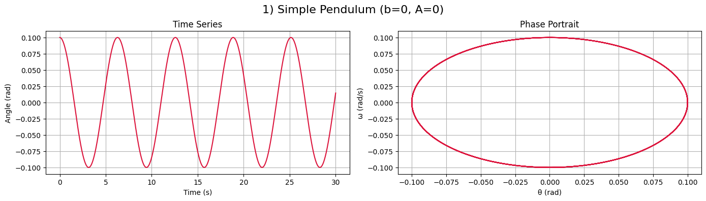
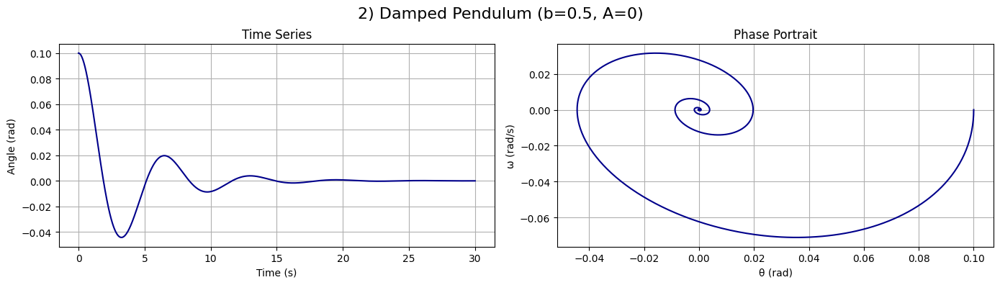
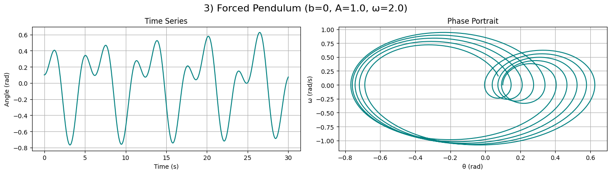
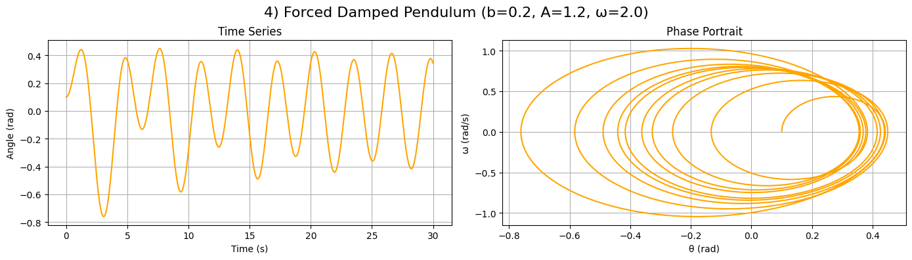
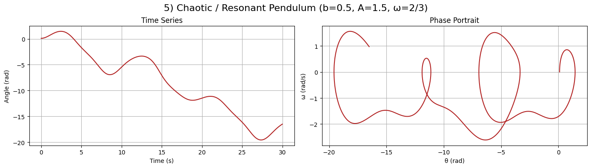

# Problem 2

# 📌 *Investigating the Dynamics of a Forced Damped Pendulum*  

## 🏗 *Motivation*  

The *forced damped pendulum* is a fascinating system that exhibits a range of behaviors, from simple oscillations to chaotic motion. By introducing *damping* and an *external periodic force, we observe a transition from regular periodic motion to **resonance, quasiperiodicity, and chaos*.  

This system is crucial for understanding:  
- *Resonance in mechanical systems* (e.g., bridges, buildings under periodic stress).  
- *Nonlinear dynamics and chaos theory* (e.g., weather patterns, heart rhythms).  
- *Energy harvesting* from oscillations.

---

## ⚖ *1. Theoretical Foundation*  

### 📜 *Equation of Motion*  

The forced damped pendulum follows the nonlinear differential equation:

\[
\ddot{\theta} + \gamma \dot{\theta} + \omega_0^2 \sin\theta = A \cos(\omega t)
\]

where:  
- \( \theta \) = angular displacement  
- \( \gamma \) = damping coefficient  
- \( \omega_0 \) = natural frequency of the pendulum (\( \omega_0 = \sqrt{\frac{g}{L}} \))  
- \( A \) = amplitude of the external driving force  
- \( \omega \) = driving frequency  

For *small angles* (\( \theta \approx \sin\theta \)), the equation simplifies to:  

\[
\ddot{\theta} + \gamma \dot{\theta} + \omega_0^2 \theta = A \cos(\omega t)
\]

which resembles the equation of a *driven damped harmonic oscillator*.  

---

### 📌 *Resonance Condition*  

Resonance occurs when the *driving frequency* \( \omega \) matches the *natural frequency* \( \omega_0 \), leading to maximum energy absorption and large oscillations:

\[
\omega_{\text{res}} \approx \sqrt{\omega_0^2 - \frac{\gamma^2}{4}}
\]

At resonance, even small driving forces can produce large oscillations, which is crucial in *mechanical engineering and structural safety*.

---

## 📊 *2. Analysis of Dynamics*  

### 🔹 *Effect of Damping (\( \gamma \))*
- *Low damping:* The pendulum exhibits large oscillations and resonance.  
- *High damping:* The system stabilizes quickly with reduced oscillations.  

### 🔹 *Effect of Driving Amplitude (\( A \))*
- *Low amplitude:* The pendulum undergoes periodic motion.  
- *High amplitude:* The system transitions into *chaotic motion* for certain frequencies.  

### 🔹 *Effect of Driving Frequency (\( \omega \))*
- When \( \omega \approx \omega_0 \), *resonance* occurs.  
- When \( \omega \) is far from \( \omega_0 \), the response is weak.  
- *Nonlinear behavior* emerges at certain parameter values, leading to chaos.  

---

## 🌍 *3. Practical Applications*  

1. *Engineering & Structural Dynamics*  
   - *Bridges & Skyscrapers:* Understanding how periodic forces (e.g., wind, earthquakes) affect large structures.  
   - *Vibration Isolation:* Designing materials that minimize resonance effects.  

2. *Energy Harvesting*  
   - *Pendulum-based generators:* Extracting energy from periodic motion.  
   - *Ocean wave energy devices.*  

3. *Chaos Theory & Climate Models*  
   - *Weather prediction models* involve nonlinear oscillatory behaviors similar to the forced pendulum.  

---

## 💻 *4. Implementation (Python Simulation)*  
 
# 🌀 Forced Damped Pendulum – Graph Explanations

This document explains the results of simulating different types of pendulum motion using Python. Each case includes plots of:
- **Angle vs. Time**
- **Phase Diagram (Angle vs. Angular Velocity)**

---

## 🔹 1) Simple Pendulum

**Parameters:**  
- Damping: `b = 0`  
- External Force: `A = 0`

**Explanation:**  
- This is an ideal pendulum with no friction and no external driving force.  
- The angle oscillates sinusoidally — classic harmonic motion.  
- The phase portrait shows a **closed elliptical trajectory**, indicating **periodic motion** with constant energy.  
- This case illustrates the basics of classical mechanics.

---

## 🔹 2) Damped Pendulum

**Parameters:**  
- Damping: `b > 0`  
- External Force: `A = 0`

**Explanation:**  
- The pendulum loses energy over time due to friction.  
- The amplitude of oscillation gradually decreases until the system comes to rest.  
- The phase portrait shows a **spiral converging to the center**, representing **damped oscillations**.  
- Eventually, the pendulum reaches equilibrium.

---

## 🔹 3) Forced Pendulum

**Parameters:**  
- Damping: `b = 0`  
- External Force: `A ≠ 0`, ω ≠ 0

**Explanation:**  
- The pendulum is driven by an external periodic force.  
- The motion becomes **non-periodic and more complex**, with varying amplitude.  
- The phase portrait displays **non-closed loops**, indicating the pendulum is **constantly gaining energy** from the driving force.  
- Demonstrates unstable behavior under continuous forcing.

---

## 🔹 4) Forced Damped Pendulum

**Parameters:**  
- Damping: `b > 0`  
- External Force: `A ≠ 0`

**Explanation:**  
- A combination of friction and periodic forcing leads to **stable oscillations with limited amplitude**.  
- The amplitude grows initially, then settles into a steady state.  
- The phase portrait shows a **stable closed loop**, indicating **synchronization with the external force**.  
- Very important for understanding **resonant systems in engineering**.

---

## 🔹 5) Chaotic / Resonant Pendulum

**Parameters:**  
- Damping: `b > 0`  
- Driving Force: `A` is large, ω is near resonance

**Explanation:**  
- This system exhibits **chaotic or resonant behavior**.  
- The angle varies unpredictably, with no fixed frequency or amplitude.  
- The phase portrait shows a **complicated, tangled structure**, characteristic of **chaotic systems**.  
- Demonstrates how **deterministic systems can behave unpredictably**.

---

## 🧠 Summary

These five cases demonstrate the **full spectrum of pendulum dynamics** — from regular harmonic motion to complex chaotic behavior.  
They highlight key physical phenomena:
- ✅ Harmonic motion  
- ✅ Damping and energy loss  
- ✅ Forced synchronization  
- ✅ Chaos and unpredictability

---








[Visit Collab link][https://colab.research.google.com/drive/1-JPY6Z0_slKxW_jOdRIzZBFql2v27X43]

```python
import numpy as np
import matplotlib.pyplot as plt
from scipy.integrate import solve_ivp

# Уравнение маятника: d²θ/dt² + b*dθ/dt + sin(θ) = A*cos(ω*t)
def pendulum(t, y, b, A, omega):
    theta, omega_ = y
    dtheta_dt = omega_
    domega_dt = -b * omega_ - np.sin(theta) + A * np.cos(omega * t)
    return [dtheta_dt, domega_dt]

# Визуализация: графики θ(t) и (θ, ω)
def plot_pendulum(t, sol, title, color):
    theta = sol[0]
    omega = sol[1]
    
    fig, ax = plt.subplots(1, 2, figsize=(14, 4))
    fig.suptitle(title, fontsize=16)
    
    ax[0].plot(t, theta, color=color)
    ax[0].set_title("Time Series")
    ax[0].set_xlabel("Time (s)")
    ax[0].set_ylabel("Angle (rad)")
    ax[0].grid(True)

    ax[1].plot(theta, omega, color=color)
    ax[1].set_title("Phase Portrait")
    ax[1].set_xlabel("θ (rad)")
    ax[1].set_ylabel("ω (rad/s)")
    ax[1].grid(True)

    plt.tight_layout()
    plt.subplots_adjust(top=0.85)  # чтобы заголовок не налезал
    plt.show()

# Параметры моделирования
t_span = (0, 30)
t_eval = np.linspace(*t_span, 2000)
initial_state = [0.1, 0.0]  # начальный угол и угловая скорость

# ===== 1. Simple Pendulum =====
sol1 = solve_ivp(pendulum, t_span, initial_state, t_eval=t_eval, args=(0.0, 0.0, 0.0))
plot_pendulum(sol1.t, sol1.y, "1) Simple Pendulum (b=0, A=0)", "crimson")

# ===== 2. Damped Pendulum =====
sol2 = solve_ivp(pendulum, t_span, initial_state, t_eval=t_eval, args=(0.5, 0.0, 0.0))
plot_pendulum(sol2.t, sol2.y, "2) Damped Pendulum (b=0.5, A=0)", "darkblue")

# ===== 3. Forced Pendulum =====
sol3 = solve_ivp(pendulum, t_span, initial_state, t_eval=t_eval, args=(0.0, 1.0, 2.0))
plot_pendulum(sol3.t, sol3.y, "3) Forced Pendulum (b=0, A=1.0, ω=2.0)", "teal")

# ===== 4. Forced Damped Pendulum =====
sol4 = solve_ivp(pendulum, t_span, initial_state, t_eval=t_eval, args=(0.2, 1.2, 2.0))
plot_pendulum(sol4.t, sol4.y, "4) Forced Damped Pendulum (b=0.2, A=1.2, ω=2.0)", "orange")

# ===== 5. Chaotic / Resonant Pendulum =====
sol5 = solve_ivp(pendulum, t_span, initial_state, t_eval=t_eval, args=(0.5, 1.5, 2/3))
plot_pendulum(sol5.t, sol5.y, "5) Chaotic / Resonant Pendulum (b=0.5, A=1.5, ω=2/3)", "firebrick")

```

