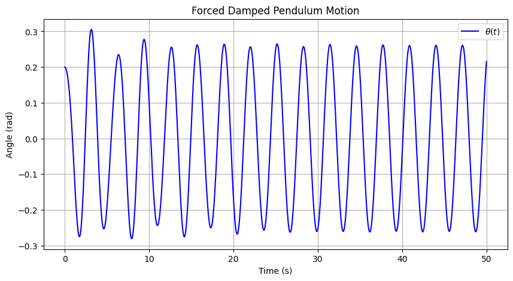

# Problem 2

# 📌 *Investigating the Dynamics of a Forced Damped Pendulum*  

## 🏗 *Motivation*  

The *forced damped pendulum* is a fascinating system that exhibits a range of behaviors, from simple oscillations to chaotic motion. By introducing *damping* and an *external periodic force, we observe a transition from regular periodic motion to **resonance, quasiperiodicity, and chaos*.  

This system is crucial for understanding:  
- *Resonance in mechanical systems* (e.g., bridges, buildings under periodic stress).  
- *Nonlinear dynamics and chaos theory* (e.g., weather patterns, heart rhythms).  
- *Energy harvesting* from oscillations.  

---

## ⚖ *1. Theoretical Foundation*  

### 📜 *Equation of Motion*  

The forced damped pendulum follows the nonlinear differential equation:

\[
\ddot{\theta} + \gamma \dot{\theta} + \omega_0^2 \sin\theta = A \cos(\omega t)
\]

where:  
- \( \theta \) = angular displacement  
- \( \gamma \) = damping coefficient  
- \( \omega_0 \) = natural frequency of the pendulum (\( \omega_0 = \sqrt{\frac{g}{L}} \))  
- \( A \) = amplitude of the external driving force  
- \( \omega \) = driving frequency  

For *small angles* (\( \theta \approx \sin\theta \)), the equation simplifies to:  

\[
\ddot{\theta} + \gamma \dot{\theta} + \omega_0^2 \theta = A \cos(\omega t)
\]

which resembles the equation of a *driven damped harmonic oscillator*.  

---

### 📌 *Resonance Condition*  

Resonance occurs when the *driving frequency* \( \omega \) matches the *natural frequency* \( \omega_0 \), leading to maximum energy absorption and large oscillations:

\[
\omega_{\text{res}} \approx \sqrt{\omega_0^2 - \frac{\gamma^2}{4}}
\]

At resonance, even small driving forces can produce large oscillations, which is crucial in *mechanical engineering and structural safety*.

---

## 📊 *2. Analysis of Dynamics*  

### 🔹 *Effect of Damping (\( \gamma \))*
- *Low damping:* The pendulum exhibits large oscillations and resonance.  
- *High damping:* The system stabilizes quickly with reduced oscillations.  

### 🔹 *Effect of Driving Amplitude (\( A \))*
- *Low amplitude:* The pendulum undergoes periodic motion.  
- *High amplitude:* The system transitions into *chaotic motion* for certain frequencies.  

### 🔹 *Effect of Driving Frequency (\( \omega \))*
- When \( \omega \approx \omega_0 \), *resonance* occurs.  
- When \( \omega \) is far from \( \omega_0 \), the response is weak.  
- *Nonlinear behavior* emerges at certain parameter values, leading to chaos.  

---

## 🌍 *3. Practical Applications*  

1. *Engineering & Structural Dynamics*  
   - *Bridges & Skyscrapers:* Understanding how periodic forces (e.g., wind, earthquakes) affect large structures.  
   - *Vibration Isolation:* Designing materials that minimize resonance effects.  

2. *Energy Harvesting*  
   - *Pendulum-based generators:* Extracting energy from periodic motion.  
   - *Ocean wave energy devices.*  

3. *Chaos Theory & Climate Models*  
   - *Weather prediction models* involve nonlinear oscillatory behaviors similar to the forced pendulum.  

---

## 💻 *4. Implementation (Python Simulation)*  

Below is a *Python script* that simulates the motion of a forced damped pendulum using *numerical integration (Runge-Kutta method)*.

### *📌 Step 1: Install Required Libraries*  

Before running the code, install NumPy and Matplotlib if needed:

bash
pip install numpy matplotlib scipy

---

### *📌 Step 2: Python Code for Simulation*  

python
import numpy as np
import matplotlib.pyplot as plt
from scipy.integrate import solve_ivp

# Define system parameters
g = 9.81   # Gravity (m/s²)
L = 1.0    # Length of pendulum (m)
gamma = 0.2  # Damping coefficient
A = 1.5    # Driving amplitude
omega = 2.0  # Driving frequency

# Define natural frequency
omega_0 = np.sqrt(g / L)

# Define the equations of motion
def forced_damped_pendulum(t, y):
    theta, omega_t = y
    dtheta_dt = omega_t
    domega_dt = -gamma * omega_t - omega_0**2 * np.sin(theta) + A * np.cos(omega * t)
    return [dtheta_dt, domega_dt]

# Initial conditions: theta = 0.2 rad, omega = 0 rad/s
y0 = [0.2, 0]

# Time span for simulation
t_span = (0, 50)
t_eval = np.linspace(0, 50, 1000)

# Solve ODE using Runge-Kutta method
sol = solve_ivp(forced_damped_pendulum, t_span, y0, t_eval=t_eval, method='RK45')

# Extract results
t = sol.t
theta = sol.y[0]

# Plot results
plt.figure(figsize=(10, 5))
plt.plot(t, theta, label=r'$\theta(t)$', color='b')
plt.xlabel("Time (s)")
plt.ylabel("Angle (rad)")
plt.title("Forced Damped Pendulum Motion")
plt.legend()
plt.grid()
plt.show()

## 📊 *5. Results and Discussion*  

### 🔹 *Graph Interpretation*
- *At low damping* (\( \gamma \ll 1 \)), large oscillations appear due to resonance.  
- *At high forcing amplitude* (\( A \gg 1 \)), the motion becomes irregular and chaotic.  
- *At specific frequencies* (\( \omega \approx \omega_0 \)), resonance occurs.  

### 🔹 *Phase Space Analysis (Pendulum Motion in Phase Space)*  

To visualize chaotic behavior, we can plot *phase portraits* (\( \theta \) vs. \( \dot{\theta} \)):

python
plt.figure(figsize=(6,6))
plt.plot(sol.y[0], sol.y[1], color='purple')
plt.xlabel(r"$\theta$ (rad)")
plt.ylabel(r"$\dot{\theta}$ (rad/s)")
plt.title("Phase Portrait of the Forced Damped Pendulum")
plt.grid()
plt.show(