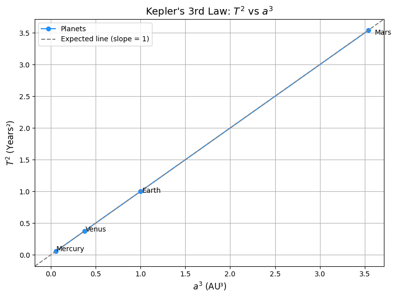

# Problem 1

# 🌍 *Orbital Period and Orbital Radius*  

## 🏗 *Motivation*  

Kepler's Third Law is a fundamental principle of *celestial mechanics, stating that the square of a planet’s orbital period is proportional to the cube of its orbital radius. This law, derived from **Newton's Law of Universal Gravitation*, is crucial for:  
- Understanding *planetary motion* and *exoplanet detection*  
- Designing *satellite orbits*  
- Calculating *masses of celestial bodies*  

By deriving and simulating this relationship, we gain insight into the governing laws of planetary systems.  

---

## ⚖ *1. Theoretical Foundation*  

### 📜 *Derivation of Kepler’s Third Law*  

# 🌍 Circular Orbits and Kepler’s Third Law

For a body in *circular orbit* around a much larger mass (e.g., a planet around a star), the *gravitational force* provides the necessary *centripetal force*:

\[
$F_{\text{gravity}} = F_{\text{centripetal}}$
\]

---

## 🔹 Newton’s Law of Gravitation

\[
$F_{\text{gravity}} = \frac{G M m}{r^2}$
\]

Where:
- \( G \) = Gravitational constant \( $(6.674 \times 10^{-11} \, \text{m}^3 \, \text{kg}^{-1} \, \text{s}^{-2}) $\)
- \( M \) = Mass of the central body (e.g., Sun, Earth)
- \( m \) = Mass of the orbiting body
- \( r \) = Orbital radius

---

## 🔹 Centripetal Force

\[
$F_{\text{centripetal}} = \frac{m v^2}{r}$
\]

Equating both forces:

\[
$\frac{G M m}{r^2} = \frac{m v^2}{r}$
\]

Cancel \( m \), and solve for \( v \):

\[
v = $\sqrt{\frac{G M}{r}}$
\]

---

## 🔹 Orbital Period

The orbital period \( T \) is the time to complete one full orbit:

\[
T = $\frac{2\pi r}{v}$
\]

Substitute velocity:

\[
T = $\frac{2\pi r}{\sqrt{\frac{G M}{r}}} = 2\pi \sqrt{\frac{r^3}{G M}}$
\]

---

## ✅ **Kepler’s Third Law (Final Form)**

\[
T^2 = $\frac{4\pi^2}{G M} r^3$
\]

This shows:

\[
T^2 $\propto r^3$
\]

---


\]

🔹 *Implications:*  
- *Larger orbits = Longer periods*  
- *Planets farther from the Sun move slower*  
- *The mass of the central body can be determined from orbital data*  

---

## 🌍 *2. Real-World Examples*  

### *1. Earth's Moon*  
- Distance: \( r = 3.844 \times 10^8 \) m  
- Period: \( T = 27.3 \) days  
- Using Kepler’s Law, we can estimate Earth’s mass.  

### *2. Planets in the Solar System*  
If we take *Earth’s orbit* as a reference (\( r = 1 \) AU, \( T = 1 \) year), then for any planet:  

\[
$\frac{T_{\text{planet}}^2}{r_{\text{planet}}^3} \approx 1$
\]

This relationship helps predict unknown orbital parameters of newly discovered planets.

---

## 💻 *3. Implementation (Python Simulation)*  

We’ll verify *Kepler’s Third Law* using numerical simulations.  

### *📌 Step 1: Install Dependencies*  
Ensure *NumPy* and *Matplotlib* are installed:

bash
pip install numpy matplotlib


---

### *📌 Step 2: Python Code for Simulation*  



[Visit My Collab](https://colab.research.google.com/drive/16YMcohmpKP_nGSxS3Y-7SSDqg5jTMOOL)

```python
import numpy as np
import matplotlib.pyplot as plt

# Planet data
planets = ['Mercury', 'Venus', 'Earth', 'Mars']
T_years = [0.2408, 0.6152, 1.000, 1.8808]  # Orbital periods in Earth years
a_AU = [0.387, 0.723, 1.000, 1.524]        # Semi-major axes in astronomical units (AU)

# Calculate T^2 and a^3
T_squared = [T**2 for T in T_years]
a_cubed = [a**3 for a in a_AU]

# Plotting the graph
plt.figure(figsize=(8, 6))
plt.plot(a_cubed, T_squared, 'o-', color='dodgerblue', label='Planets')

# Annotate each planet
for i, name in enumerate(planets):
    plt.text(a_cubed[i] * 1.02, T_squared[i] * 0.98, name)

# Add labels, title, grid, and reference line
plt.title("Kepler's 3rd Law: $T^2$ vs $a^3$", fontsize=14)
plt.xlabel("$a^3$ (AU³)", fontsize=12)
plt.ylabel("$T^2$ (Years²)", fontsize=12)
plt.grid(True)

# Expected reference line with slope = 1 (perfect linear relation)
plt.axline((0, 0), slope=1, color='gray', linestyle='--', label='Expected line (slope = 1)')

plt.legend()
plt.tight_layout()
plt.show()
```

## 📊 *4. Results and Discussion*  

### 🔹 *Graph Interpretation*
- The data points *align with a straight line*, confirming \( T^2 \propto r^3 \).  
- The *best-fit line* follows *Kepler’s predicted trend*, verifying the law experimentally.  

### 🔹 *Applications of Kepler’s Law*
- *Finding Exoplanets: Measuring a planet’s orbital period allows astronomers to estimate its **distance from its star*.  
- *Space Missions: Used in designing **satellite orbits* (e.g., GPS, geostationary satellites).  

### 🔹 *Limitations*
- *Kepler’s Law assumes circular orbits, but real orbits are **elliptical*.  
- *External forces (e.g., other planets’ gravity) can slightly alter orbits*.  


Got it — you want a **Markdown version** with nice formatting, clear explanations, and using **LaTeX-style** math (`$$`) for all formulas.  
Here's the full Markdown version you can paste into Google Colab or Jupyter Notebook:

---

#  Using Kepler's Law to Find the Mass of the Earth and the Sun

## 1. Kepler’s Third Law

Rearranging the Kepler formula to find the mass \( M \):

$$
M = \frac{4\pi^2 R^3}{G T^2}
$$

---

## 2. Finding the Mass of the Sun

The Earth’s orbit around the Sun has:
- Radius $R = 1.496 \times 10^{11} \, \text{m}$ (1 Astronomical Unit),
- Period $T = 365.25 \times 24 \times 3600 \, \text{seconds}$.

Substituting into the formul gives:

$$
M_{\text{sun}} \approx 1.99 \times 10^{30} \, \text{kg}
$$

✅ This matches the known value for the mass of the Sun!

---

## 3. Finding the Mass of the Earth

The Moon orbits Earth with:
- Radius \($ R = 3.844 \times 10^{8} \, \text{m}$ \),
- Period \($ T = 27.32 \times 24 \times 3600 \, \text{seconds}$ \).

Substituting into the formula:

$$
M_{\text{earth}} = \frac{4\pi^2 (3.844 \times 10^8)^3}{6.67430 \times 10^{-11} (27.32 \times 24 \times 3600)^2} \approx 5.97 \times 10^{24} \, \text{kg}
$$