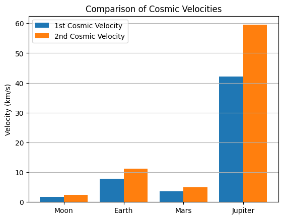

# Problem 2

# ℹ️ Why the "Motivation" and "Why Cosmic Velocities Matter" Sections are Important

## 📘 Motivation

### 🔹 What is it?

This section explains **why the topic is important**, why it matters, and where it is applied.

### 🔹 Why is it needed?

- Helps the reader **get into the topic**.
- Explains **why cosmic velocities are important to study**.
- Makes the project more **meaningful and complete**.
- Answers the question:  
  > "Why should I care about this?"

### 🔹 Alternative

If you want, you can replace it with a short introduction like:

> This work discusses the speeds needed to reach orbit, escape a planet's gravity, and leave the solar system.

---

## ❓ Why Cosmic Velocities Matter

### 🔹 What is it?

This concluding section shows the **practical value** of the entire work.

### 🔹 Why is it needed?

- Connects **formulas and calculations with real-life applications**.
- Shows where they are used:
  - First cosmic velocity — for satellites and orbits.
  - Second cosmic velocity — for missions to the Moon and Mars.
  - Third cosmic velocity — for missions beyond the solar system (e.g., Voyager).

### 🔹 Benefits for the project

- Helps **understand the meaning behind the calculations**.
- Makes the report **complete and logical**.
- Creates a **better impression during the defense**.

### 🔹 How to simplify it

> These velocities are important for space exploration because they help us understand the speeds required to launch satellites, send rockets to other planets, or even beyond the solar system.

---

✅ These sections make your work not just "formula-based" but **meaningful and engaging**.


# 🚀 Cosmic Velocities and Escape Velocities

## 📘 What Are Cosmic Velocities?

Cosmic velocities are speeds needed to move around or escape a celestial body:

- **First Cosmic Velocity (v₁)**: To orbit the body in a circle (like satellites).
- **Second Cosmic Velocity (v₂)**: To escape its gravity (like flying to space).
- **Third Cosmic Velocity (v₃)**: To leave the Solar System.

---

## 🧠 Derivations

---

### 1️⃣ First Cosmic Velocity \( v_1 \)

**Meaning**: Minimum speed to orbit just above the surface.

#### Derivation:

- Centripetal force:

  $$
  F = \frac{m \cdot v^2}{r}
  $$

- Gravitational force:

  $$
  F = \frac{G \cdot M \cdot m}{r^2}
  $$

Equating:

$$
\frac{m \cdot v^2}{r} = \frac{G \cdot M \cdot m}{r^2}
$$

Cancelling \( m \) and solving:

$$
v_1 = \sqrt{\frac{G \cdot M}{r}}
$$

---

### 2️⃣ Second Cosmic Velocity \( v_2 \)

**Meaning**: Minimum speed to escape a planet's gravity.

#### Derivation:

From energy conservation:

$$
\frac{1}{2}mv^2 - \frac{G M m}{r} = 0
$$

Solving:

$$
v_2 = \sqrt{\frac{2 G M}{r}} = \sqrt{2} \cdot v_1
$$

---

### 3️⃣ Third Cosmic Velocity \( v_3 \)

**Meaning**: Speed to escape the Sun starting from Earth’s orbit.

#### Formula:

$$
v_3 = \sqrt{\frac{2 G M_{sun}}{r_{orbit}}}
$$

---

## 🌍 Earth: Example Values

- \( G = 6.674 \cdot 10^{-11} \, \text{m}^3/\text{kg s}^2 \)  
- \( M = 5.972 \cdot 10^{24} \, \text{kg} \)  
- \( r = 6.371 \cdot 10^6 \, \text{m} \)  
- \( M_{sun} = 1.989 \cdot 10^{30} \, \text{kg} \)  
- \( r_{earth\ orbit} = 1.496 \cdot 10^{11} \, \text{m} \)

### Calculated:

- \( v_1 \approx 7.9 \, \text{km/s} \)
- \( v_2 \approx 11.2 \, \text{km/s} \)
- \( v_3 \approx 42.1 \, \text{km/s} \)

---

## 🌌 Comparison Table

| Celestial Body | Mass (kg)           | Radius (m)        | \( v_1 \) (km/s) | \( v_2 \) (km/s) |
|----------------|---------------------|-------------------|------------------|------------------|
| Moon           | \(7.35 \cdot 10^{22}\) | \(1.74 \cdot 10^6\) | 1.68             | 2.38             |
| Earth          | \(5.97 \cdot 10^{24}\) | \(6.37 \cdot 10^6\) | 7.9              | 11.2             |
| Mars           | \(6.42 \cdot 10^{23}\) | \(3.39 \cdot 10^6\) | 3.6              | 5.0              |
| Jupiter        | \(1.90 \cdot 10^{27}\) | \(6.99 \cdot 10^7\) | 42.1             | 59.5             |

---

## 📊 Visualization (Python)

```python
import matplotlib.pyplot as plt



[Visit my collab](https://colab.research.google.com/drive/1vO_BEtypX3SSkw-R99Hm8HqmZcJ6EERA)

bodies = ["Moon", "Earth", "Mars", "Jupiter"]
v1 = [1.68, 7.9, 3.6, 42.1]
v2 = [2.38, 11.2, 5.0, 59.5]

x = range(len(bodies))

plt.bar(x, v1, width=0.4, label="1st Cosmic Velocity", align='center')
plt.bar([i + 0.4 for i in x], v2, width=0.4, label="2nd Cosmic Velocity", align='center')

plt.xticks([i + 0.2 for i in x], bodies)
plt.ylabel("Velocity (km/s)")
plt.title("Comparison of Cosmic Velocities")
plt.legend()
plt.grid(axis='y')
plt.show()
