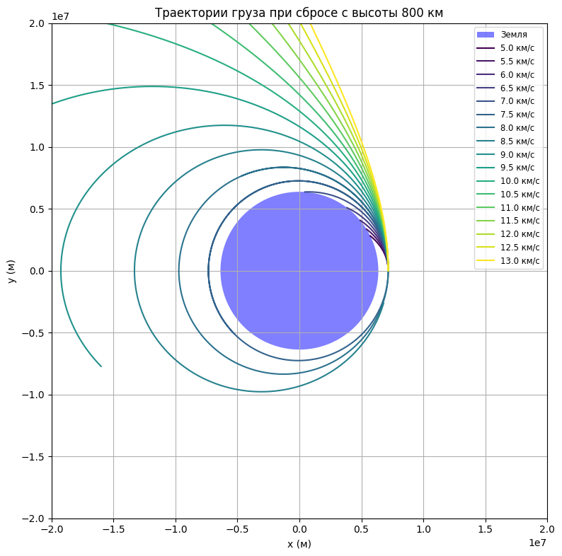

# Problem 3

# 🌍 Trajectories of a Freely Released Payload Near Earth


## 📌 Motivation

When a spacecraft releases a payload near Earth, the path it follows depends on:

- Its **initial position and speed**
- The **direction of motion**
- The **gravitational pull of Earth**

Understanding these paths helps in planning:

- Satellite orbits
- Reentry to Earth
- Escaping Earth's gravity for deep space travel

---

## 🧠 Key Concepts

### 1. Newton's Law of Universal Gravitation

> Every object attracts every other object with a force:

\[
F = \frac{G \cdot M \cdot m}{r^2}
\]

Where:

- \( F \) is the gravitational force  
- \( G \) is the gravitational constant  
- \( M \) is the mass of Earth  
- \( m \) is the mass of the payload  
- \( r \) is the distance from the center of Earth  

This force always pulls toward the center of Earth.

---

### 2. Kinetic and Potential Energy

A payload has two key types of energy:

- **Kinetic Energy** (moving):  
\[
KE = \frac{1}{2}mv^2
\]

- **Gravitational Potential Energy**:  
\[
PE = -\frac{G M m}{r}
\]

> The total energy determines the shape of the trajectory.

---

## 🚀 Types of Trajectories

### 🌐 Circular Orbit
- Speed is **just right** to balance gravity  
- Path is a **circle**  
- **Total energy** is constant and **negative**

---

### 🔁 Elliptical Orbit
- Speed is **not perfectly balanced**  
- Payload moves **closer and farther** from Earth  
- **Total energy** is still **negative**

---

### 🪃 Parabolic Trajectory
- Speed is **just enough** to escape Earth  
- **Total energy** is **zero**  
- It’s a **boundary** between orbit and escape

---

### 🛫 Hyperbolic Trajectory
- Speed is **greater than needed** to escape  
- Payload **leaves Earth forever**  
- **Total energy** is **positive**

---

## 🧮 Escape Velocity

The speed needed to leave Earth without falling back:

\[
v_{escape} = \sqrt{\frac{2GM}{r}}
\]

At sea level:

\[
v_{escape} \approx 11.2 \text{ km/s}
\]

---

## 🔢 Numerical Simulation (Concept)

To simulate motion step-by-step:

1. Set the **initial position and velocity** of the payload.
2. At each time step:
    - Compute the gravitational force:
      \[
      F = \frac{G M m}{r^2}
      \]
    - Calculate acceleration:  
      \[
      a = \frac{F}{m}
      \]
    - Update velocity:  
      \[
      v_{new} = v + a \cdot \Delta t
      \]
    - Update position:  
      \[
      r_{new} = r + v \cdot \Delta t
      \]
3. Repeat to track the trajectory shape (circular, elliptical, parabolic, hyperbolic)

---

## 📊 Visualization Goals

- A plot of **Earth and the payload path**
- Comparison of **multiple initial speeds**
- Labels for **escape**, **reentry**, and **orbit scenarios**

---

## 🌌 Real-World Applications

- Satellites must be released into **elliptical or circular orbits**
- Spacecraft aiming for other planets use **hyperbolic trajectories**
- Reentry capsules follow **elliptical or parabolic paths**

---

## ✅ Summary

| Condition                 | Trajectory Type     | Total Energy |
|--------------------------|---------------------|--------------|
| Low speed                | Elliptical orbit    | Negative     |
| Just right speed         | Circular orbit      | Negative     |
| Exactly escape speed     | Parabolic path      | Zero         |
| Greater than escape speed| Hyperbolic path     | Positive     |


## Problem 3: Motion of a Body in Earth's Gravitational Field

**Problem statement:**
- Create a plot with the Earth drawn to scale.
- Initial position: 800 km above Earth's surface (placed on the right-hand side of the plot).
- Launch a body with various initial speeds: 5 km/s, 5.5 km/s, ..., up to 13 km/s.
- Only gravitational interaction is considered.

**Model:**
- Earth's radius: 6371 km.
- Gravitational acceleration calculated using Newton’s law of universal gravitation.
- Two-dimensional plane, launch point at (R_Earth + 800 km, 0).
- Each trajectory shows motion of the body for a given initial velocity.

**Result:**



[Visit My Collab](https://colab.research.google.com/drive/1t8rJKeSnbXocOYi4MwUZABzlYJrSehkq)

``` python
import numpy as np
import matplotlib.pyplot as plt

# Гравитационные константы
G = 6.67430e-11  # м^3 кг^-1 с^-2
M = 5.972e24     # масса Земли, кг
R_earth = 6.371e6  # радиус Земли, м

# Начальные условия
altitude = 800e3  # 800 км над поверхностью
r0 = np.array([R_earth + altitude, 0])  # начальная позиция справа от Земли
velocities = np.arange(5e3, 13.5e3, 0.5e3)  # скорости от 5 до 13 км/с

# Временные параметры
dt = 1  # шаг по времени (с)
T = 10000  # общее время моделирования (с)
steps = int(T / dt)

# Создание графика
fig, ax = plt.subplots(figsize=(8, 8))
theta = np.linspace(0, 2 * np.pi, 500)
earth_x = R_earth * np.cos(theta)
earth_y = R_earth * np.sin(theta)
ax.fill(earth_x, earth_y, 'b', label='Земля', alpha=0.5)

# Симуляция для каждой скорости
colors = plt.cm.viridis(np.linspace(0, 1, len(velocities)))

for v0, color in zip(velocities, colors):
    r = r0.copy()
    v = np.array([0, v0])
    traj_x, traj_y = [], []

    for _ in range(steps):
        r_mag = np.linalg.norm(r)
        if r_mag < R_earth:  # если груз врезался в Землю
            break
        a = -G * M * r / r_mag**3
        v += a * dt
        r += v * dt
        traj_x.append(r[0])
        traj_y.append(r[1])

    ax.plot(traj_x, traj_y, label=f'{v0/1000:.1f} км/с', color=color)

# Оформление графика
ax.set_aspect('equal')
ax.set_xlim(-2e7, 2e7)
ax.set_ylim(-2e7, 2e7)
ax.set_xlabel('x (м)')
ax.set_ylabel('y (м)')
ax.set_title('Траектории груза при сбросе с высоты 800 км')
ax.legend(loc='upper right', fontsize='small')
plt.grid(True)
plt.tight_layout()
plt.show()
```

- The blue circle represents Earth.
- Each curve shows the trajectory for a specific launch speed (from 5 to 13 km/s).
- We can observe which speeds lead to orbits, collisions with Earth, or escape into space.

---

## Wave Problem: Interference of Waves from Multiple Sources

**Problem statement:**
- Demonstrate wave interference for one, two, and multiple sources.
- Display the result as a heatmap and create an animation.
- Source arrangements:
  - One centered source,
  - Two along the X-axis,
  - Three placed in a triangle.
- Plot the results and create a gif animation.

**Method:**
- Wave equation used:  
  `z(x, y, t) = A * sin(k * r - ω * t)`
- The contribution from each source is summed.
- Grid from -10 to 10 in both x and y.
- Animation shows wave propagation and interference over time.

**Result (animation):**

from IPython.display import Image
Image(filename="wave_interference.gif")

[Visit My Collab](wave_interference.gif)

- Left plot: one source — circular wavefronts.
- Middle plot: two sources — clear interference pattern.
- Right plot: three sources in a triangle — complex interference structure.

---

**Conclusion:**
- Orbital trajectories depend critically on initial velocity.
- Wave interference clearly demonstrates the principle of superposition: the combination of phase and amplitude when multiple waves interact.
