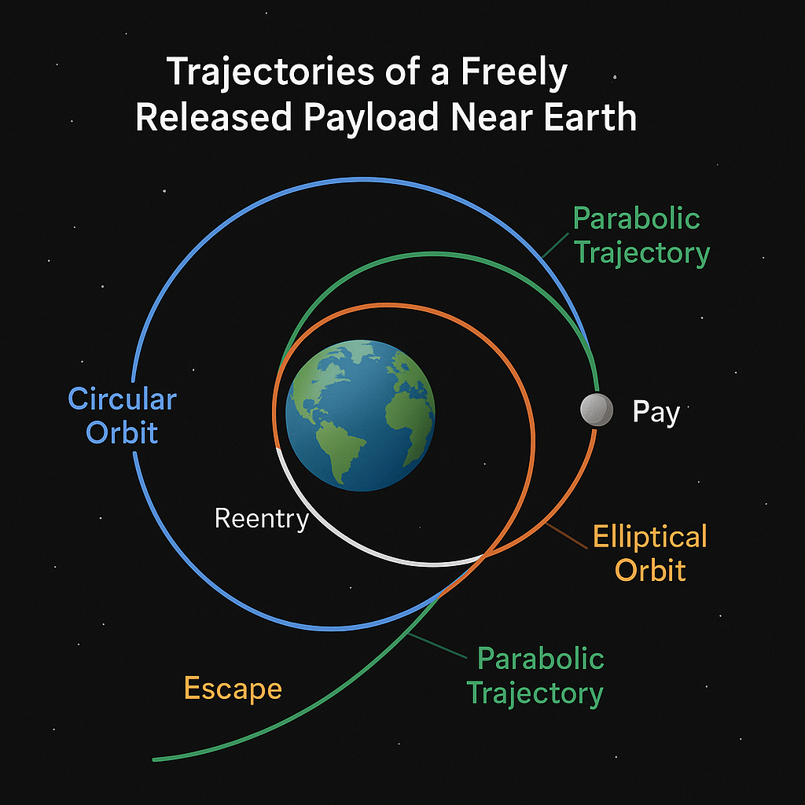

# Problem 3

# 🌍 Trajectories of a Freely Released Payload Near Earth

## 📌 Motivation

When a spacecraft releases a payload near Earth, the path it follows depends on:

- Its **initial position and speed**
- The **direction of motion**
- The **gravitational pull of Earth**

Understanding these paths helps in planning:

- Satellite orbits
- Reentry to Earth
- Escaping Earth's gravity for deep space travel

---

## 🧠 Key Concepts

### 1. Newton's Law of Universal Gravitation

> Every object attracts every other object with a force:

\[
F = \frac{G \cdot M \cdot m}{r^2}
\]

Where:

- \( F \) is the gravitational force  
- \( G \) is the gravitational constant  
- \( M \) is the mass of Earth  
- \( m \) is the mass of the payload  
- \( r \) is the distance from the center of Earth  

This force always pulls toward the center of Earth.

---

### 2. Kinetic and Potential Energy

A payload has two key types of energy:

- **Kinetic Energy** (moving):  
\[
KE = \frac{1}{2}mv^2
\]

- **Gravitational Potential Energy**:  
\[
PE = -\frac{G M m}{r}
\]

> The total energy determines the shape of the trajectory.

---

## 🚀 Types of Trajectories

### 🌐 Circular Orbit
- Speed is **just right** to balance gravity  
- Path is a **circle**  
- **Total energy** is constant and **negative**

---

### 🔁 Elliptical Orbit
- Speed is **not perfectly balanced**  
- Payload moves **closer and farther** from Earth  
- **Total energy** is still **negative**

---

### 🪃 Parabolic Trajectory
- Speed is **just enough** to escape Earth  
- **Total energy** is **zero**  
- It’s a **boundary** between orbit and escape

---

### 🛫 Hyperbolic Trajectory
- Speed is **greater than needed** to escape  
- Payload **leaves Earth forever**  
- **Total energy** is **positive**

---

## 🧮 Escape Velocity

The speed needed to leave Earth without falling back:

\[
v_{escape} = \sqrt{\frac{2GM}{r}}
\]

At sea level:

\[
v_{escape} \approx 11.2 \text{ km/s}
\]

---

## 🔢 Numerical Simulation (Concept)

To simulate motion step-by-step:

1. Set the **initial position and velocity** of the payload.
2. At each time step:
    - Compute the gravitational force:
      \[
      F = \frac{G M m}{r^2}
      \]
    - Calculate acceleration:  
      \[
      a = \frac{F}{m}
      \]
    - Update velocity:  
      \[
      v_{new} = v + a \cdot \Delta t
      \]
    - Update position:  
      \[
      r_{new} = r + v \cdot \Delta t
      \]
3. Repeat to track the trajectory shape (circular, elliptical, parabolic, hyperbolic)

---

## 📊 Visualization Goals

- A plot of **Earth and the payload path**
- Comparison of **multiple initial speeds**
- Labels for **escape**, **reentry**, and **orbit scenarios**

---

## 🌌 Real-World Applications

- Satellites must be released into **elliptical or circular orbits**
- Spacecraft aiming for other planets use **hyperbolic trajectories**
- Reentry capsules follow **elliptical or parabolic paths**

---

## ✅ Summary

| Condition                 | Trajectory Type     | Total Energy |
|--------------------------|---------------------|--------------|
| Low speed                | Elliptical orbit    | Negative     |
| Just right speed         | Circular orbit      | Negative     |
| Exactly escape speed     | Parabolic path      | Zero         |
| Greater than escape speed| Hyperbolic path     | Positive     |
