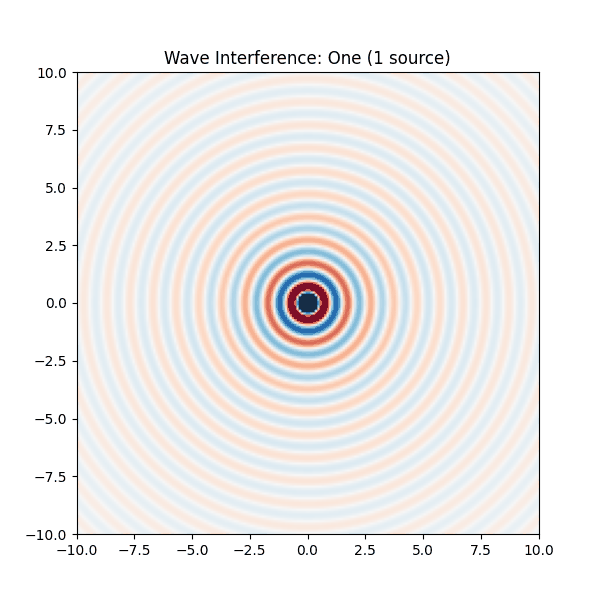
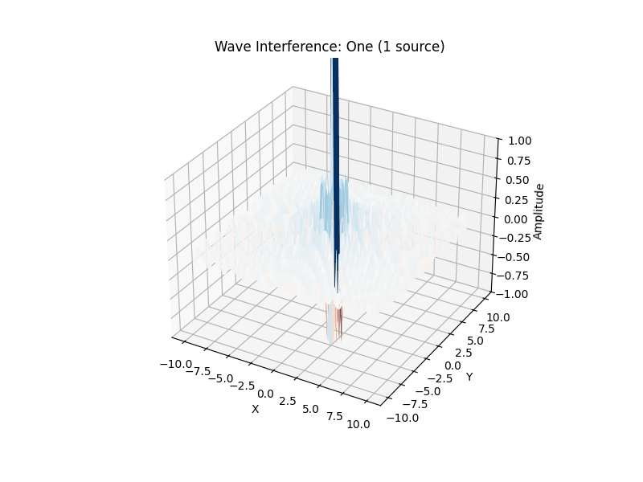

# Problem 1

## Wave Problem: Interference of Waves from Multiple Sources

**Problem statement:**
- Demonstrate wave interference for one, two, and multiple sources.
- Display the result as a heatmap and create an animation.
- Source arrangements:
  - One centered source,
  - Two along the X-axis,
  - Three placed in a triangle.
- Plot the results and create a gif animation.

**Method:**
- Wave equation used:  
  `z(x, y, t) = A * sin(k * r - ω * t)`
- The contribution from each source is summed.
- Grid from -10 to 10 in both x and y.
- Animation shows wave propagation and interference over time.

**Result (animation):**



``` python
import numpy as np
import matplotlib.pyplot as plt
import matplotlib.animation as animation

# --- Grid Setup ---
size = 200
x = np.linspace(-10, 10, size)
y = np.linspace(-10, 10, size)
X, Y = np.meshgrid(x, y)

# --- Wave Function ---
def wave_source(X, Y, x0, y0, t, wavelength=1, speed=1):
    r = np.sqrt((X - x0)**2 + (Y - y0)**2)
    k = 2 * np.pi / wavelength
    omega = k * speed
    return np.sin(k * r - omega * t) / (r + 1e-6)  # avoid division by zero

# --- Source Patterns ---
def get_sources(pattern):
    if pattern == "one":
        return [(0, 0)]
    elif pattern == "two":
        return [(-3, 0), (3, 0)]
    elif pattern == "triangle":
        R = 4
        angles = np.linspace(0, 2*np.pi, 4)[:-1]
        return [(R * np.cos(a), R * np.sin(a)) for a in angles]
    elif pattern == "pentagon":
        R = 5
        angles = np.linspace(0, 2*np.pi, 6)[:-1]
        return [(R * np.cos(a), R * np.sin(a)) for a in angles]

patterns = ["one", "two", "triangle", "pentagon"]

# --- Plot Setup ---
fig, ax = plt.subplots(figsize=(6,6))
heatmap = ax.imshow(np.zeros((size, size)), cmap='RdBu', vmin=-1, vmax=1, extent=(-10, 10, -10, 10))
title = ax.set_title("")

# --- Frame Update Function ---
def update(frame):
    pattern = patterns[(frame // 20) % len(patterns)]
    t = frame % 20
    sources = get_sources(pattern)
    Z = sum(wave_source(X, Y, sx, sy, t) for sx, sy in sources)
    heatmap.set_data(Z)
    title.set_text(f"Wave Interference: {pattern.capitalize()} ({len(sources)} source{'s' if len(sources) > 1 else ''})")
    return heatmap, title

# --- Create Animation ---
ani = animation.FuncAnimation(fig, update, frames=80, interval=100, blit=False)

# --- Save GIF ---
ani.save("wave_interference.gif", writer="pillow")
plt.close()
print("✅ GIF saved as wave_interference.gif")
```



``` python
import numpy as np
import matplotlib.pyplot as plt
import matplotlib.animation as animation
from mpl_toolkits.mplot3d import Axes3D

# --- Grid Setup ---
size = 100  # smaller size for faster rendering
x = np.linspace(-10, 10, size)
y = np.linspace(-10, 10, size)
X, Y = np.meshgrid(x, y)

# --- Wave Function ---
def wave_source(X, Y, x0, y0, t, wavelength=1, speed=1):
    r = np.sqrt((X - x0)**2 + (Y - y0)**2)
    k = 2 * np.pi / wavelength
    omega = k * speed
    return np.sin(k * r - omega * t) / (r + 1e-6)

# --- Source Patterns ---
def get_sources(pattern):
    if pattern == "one":
        return [(0, 0)]
    elif pattern == "two":
        return [(-3, 0), (3, 0)]
    elif pattern == "triangle":
        R = 4
        angles = np.linspace(0, 2*np.pi, 4)[:-1]
        return [(R * np.cos(a), R * np.sin(a)) for a in angles]
    elif pattern == "pentagon":
        R = 5
        angles = np.linspace(0, 2*np.pi, 6)[:-1]
        return [(R * np.cos(a), R * np.sin(a)) for a in angles]

patterns = ["one", "two", "triangle", "pentagon"]

# --- Plot Setup ---
fig = plt.figure(figsize=(8, 6))
ax = fig.add_subplot(111, projection='3d')

Z = np.zeros_like(X)
surf = ax.plot_surface(X, Y, Z, cmap='RdBu', vmin=-1, vmax=1, linewidth=0, antialiased=True)

ax.set_zlim(-1, 1)
ax.set_xlabel('X')
ax.set_ylabel('Y')
ax.set_zlabel('Amplitude')
title = ax.set_title("")

# --- Frame Update Function ---
def update(frame):
    pattern = patterns[(frame // 20) % len(patterns)]
    t = frame % 20
    sources = get_sources(pattern)
    Z = sum(wave_source(X, Y, sx, sy, t) for sx, sy in sources)
    ax.clear()  # careful: only light clearing
    surf = ax.plot_surface(X, Y, Z, cmap='RdBu', vmin=-1, vmax=1, linewidth=0, antialiased=True)
    ax.set_zlim(-1, 1)
    ax.set_xlabel('X')
    ax.set_ylabel('Y')
    ax.set_zlabel('Amplitude')
    ax.set_title(f"Wave Interference: {pattern.capitalize()} ({len(sources)} source{'s' if len(sources) > 1 else ''})")
    return surf,

# --- Create Animation ---
ani = animation.FuncAnimation(fig, update, frames=80, interval=100, blit=False)

# --- Save Animation ---
ani.save('/content/wave_interference_3d.gif', writer='pillow')
plt.close()

print("✅ 3D GIF saved as /content/wave_interference_3d.gif")
```

- Left plot: one source — circular wavefronts.
- Middle plot: two sources — clear interference pattern.
- Right plot: three sources in a triangle — complex interference structure.

---

**Conclusion:**
- Orbital trajectories depend critically on initial velocity.
- Wave interference clearly demonstrates the principle of superposition: the combination of phase and amplitude when multiple waves interact.