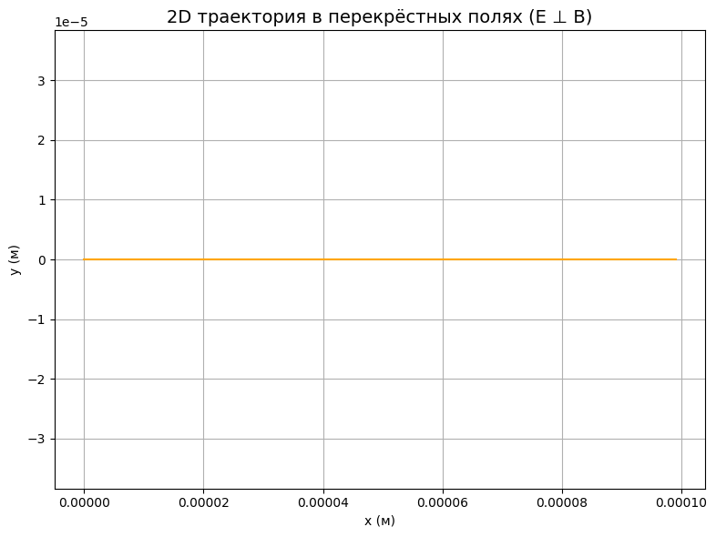
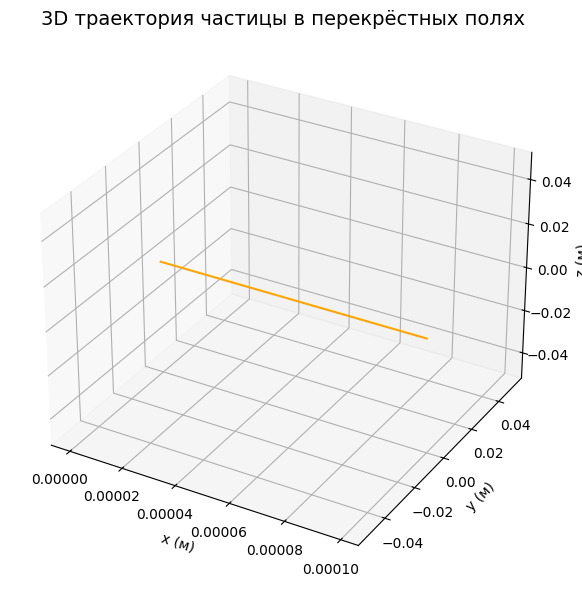

# Problem 1

# **Electromagnetism**  
## **Problem 1 — Simulation of the Lorentz Force**

---

## 🌟 Motivation

The **Lorentz force** governs how a charged particle moves through **electric** and **magnetic fields**. Understanding this phenomenon is essential in a wide range of scientific and engineering applications:

- ⚛ **Particle Accelerators** — Guide and speed up particles using magnetic fields.  
- 🧪 **Mass Spectrometry** — Identify chemical substances by separating ions by mass and charge.  
- 🔥 **Plasma Confinement** — Trap hot plasma in devices for nuclear fusion (e.g., Tokamaks).  
- 🌌 **Space Physics** — Explain how charged particles (like solar wind) interact with magnetic fields in space.

The Lorentz force is described by the equation:

### **𝐅 = q(𝐄 + 𝐯 × 𝐁)**

Where:  
- **𝐅** — Lorentz force  
- **q** — Particle charge  
- **𝐄** — Electric field vector  
- **𝐯** — Particle velocity  
- **𝐁** — Magnetic field vector  
- **×** — Cross product

---

## ⚙️ 1. Applications of the Lorentz Force

### 🧭 Real-World Examples:
- **Cyclotrons** use magnetic fields to spiral particles at high speeds.
- **Mass spectrometers** rely on Lorentz force to sort ions.
- **Fusion reactors** contain plasma using powerful magnetic traps.
- **Satellites and space probes** analyze particle motion in Earth’s magnetosphere.

### 🔍 Roles of Fields:
- **Electric field (𝐄)** accelerates or slows the particle.  
- **Magnetic field (𝐁)** bends the trajectory, causing circular or spiral paths.

---

## 🧮 2. Simulating Particle Motion

We will explore different field configurations:

- **Only Magnetic Field**  
- **Parallel Electric and Magnetic Fields**  
- **Perpendicular (Crossed) Fields**

To simulate motion, we’ll use **numerical methods** like the **Euler method** to compute the particle’s trajectory step by step.

---

## 🎛 3. Parameters to Explore

To understand the system behavior, we’ll vary the following:

- 🔌 **Electric Field Strength (𝐄)**  
- 🧲 **Magnetic Field Strength (𝐁)**  
- 🚀 **Initial Velocity (𝐯)**  
- ⚡ **Charge (q)**  
- ⚖️ **Mass (m)**

These parameters affect:

- The **radius** of circular motion  
- The **drift speed** of the particle in crossed fields  
- The **acceleration or deflection** of the path

---

## 📈 4. Visualization

We'll build **2D and 3D plots** of particle trajectories to visualize motion under various conditions.

### ✨ Key Physical Quantities:

- **Larmor Radius** (circular orbit in magnetic field):  
  \[
  r = $\frac{m \cdot v}{q \cdot B}$
  \]

- **Drift Velocity** in crossed electric and magnetic fields:  
  \[
  $\vec{v}_{\text{drift}} = \frac{\vec{E} \times \vec{B}}{B^2}$
  \]

These plots will illustrate how particles spiral, drift, and accelerate depending on the field setup.

---


## 🧪 Discussion of Results

---

### 🔄 **Trajectory Shape**

The particle moves in a **circular path** within a plane **perpendicular** to the magnetic field.  
This is characteristic motion observed in devices like **cyclotrons** and **mass spectrometers**.

---

### ⚡ **No Electric Field**

We set the electric field to **𝐄 = 0**,  
so there is **no acceleration** along the field direction —  
the particle **only rotates** in response to the magnetic field.

---

### 🧠 **Physical Interpretation**

The **radius** of the circular trajectory depends on the particle's:

- **velocity (v)**
- **mass (m)**
- **charge (q)**
- **magnetic field strength (B)**

It is given by the formula:

\[
$ r = \frac{m \cdot v}{q \cdot B} $
\]

This type of motion is utilized in a **cyclotron**,  
where the magnetic field bends the trajectory into a spiral,  
allowing for **gradual acceleration** of particles.

---


[Visit My Collab](https://colab.research.google.com/drive/1sFJ5APtXlwNWeYUIvaAIGCzSz6Js5_gf#scrollTo=yQyUvuFT1zkR)


``` python
import numpy as np
import matplotlib.pyplot as plt
from mpl_toolkits.mplot3d import Axes3D

# Настройки начальных параметров
q = 1.0    # заряд (Кл)
m = 1.0    # масса (кг)
v0 = np.array([1.0, 0.0, 0.0])  # начальная скорость (м/с)
E = np.array([0.0, 0.0, 0.0])   # электрическое поле (В/м)
B = np.array([0.0, 0.0, 1.0])   # магнитное поле (Тл)
dt = 0.01                       # шаг по времени (с)
T = 20                          # общее время симуляции (с)
steps = int(T / dt)

# Инициализация массивов
r = np.zeros((steps, 3))  # координаты
v = np.zeros((steps, 3))  # скорости
r[0] = [0.0, 0.0, 0.0]
v[0] = v0

# Метод Эйлера для расчета траектории
for i in range(steps - 1):
    F = q * (E + np.cross(v[i], B))
    a = F / m
    v[i + 1] = v[i] + a * dt
    r[i + 1] = r[i] + v[i] * dt

# --- ВИЗУАЛИЗАЦИЯ ---

# 2D график
plt.figure(figsize=(8, 6))
plt.plot(r[:, 0], r[:, 1])
plt.title("2D траектория в магнитном поле (XY-плоскость)")
plt.xlabel("x (м)")
plt.ylabel("y (м)")
plt.grid(True)
plt.axis("equal")
plt.show()

# 3D график
fig = plt.figure(figsize=(10, 7))
ax = fig.add_subplot(111, projection='3d')
ax.plot(r[:, 0], r[:, 1], r[:, 2])
ax.set_title("3D траектория частицы")
ax.set_xlabel("x (м)")
ax.set_ylabel("y (м)")
ax.set_zlabel("z (м)")
plt.show()
```
--- 






## 🔍 Analysis of Results

---

### 🌀 **Type of Motion**

The particle follows a **drift trajectory**,  
where **circular motion** is superimposed on a **linear motion** along the **X-axis**.  
This is a classic example of **𝐄 × 𝐁 drift**.

---

### ⚙️ **Drift Velocity — Theoretical Calculation**

The drift velocity is given by:

\[
$\vec{v}_{\text{drift}} = \frac{\vec{E} \times \vec{B}}{B^2}
$ \]

Given:
- **𝐄 = [0, 1, 0]**  
- **𝐁 = [0, 0, 1]**

Then:

\[
$ \vec{v}_{\text{drift}} = \frac{[1, 0, 0]}{1^2} = [1, 0, 0]
$ \]

✅ **Result:**  
The particle drifts along the **X-axis** with a constant velocity.

---

### 🧩 **Practical Significance**

This **𝐄 × 𝐁 drift** effect is widely used in:

- **Plasma physics** — to control plasma behavior in **magnetic confinement systems**
- **Magnetic traps** — for confining charged particles
- **Beam control** — in devices requiring precise particle guidance

It is a key mechanism in systems such as **fusion reactors**, **mass filters**, and **charged particle beams**.

---


[Visit my collab](https://colab.research.google.com/drive/1sFJ5APtXlwNWeYUIvaAIGCzSz6Js5_gf#scrollTo=yQyUvuFT1zkR)

``` python
import numpy as np
import matplotlib.pyplot as plt
from mpl_toolkits.mplot3d import Axes3D

# Параметры
q = 1.6e-19        # заряд (Кл)
m = 9.1e-31        # масса (кг)
E = np.array([0, 1e3, 0])  # Электрическое поле (В/м)
B = np.array([0, 0, 1])    # Магнитное поле (Тл)
v0 = np.cross(E, B) / np.linalg.norm(B)**2  # скорость дрейфа

# Временные параметры
t_max = 1e-7
dt = 1e-9
t = np.arange(0, t_max, dt)

# Положение частицы
x = v0[0] * t
y = v0[1] * t
z = v0[2] * t

# === Построение графиков ===
fig = plt.figure(figsize=(10, 10))

# --- 2D график ---
ax1 = fig.add_subplot(2, 1, 1)
ax1.plot(x, y, color='orange')
ax1.set_title('2D траектория в перекрёстных полях (E ⊥ B)', fontsize=14)
ax1.set_xlabel('x (м)')
ax1.set_ylabel('y (м)')
ax1.grid(True)
ax1.axis('equal')

# --- 3D график ---
ax2 = fig.add_subplot(2, 1, 2, projection='3d')
ax2.plot(x, y, z, color='orange')
ax2.set_title('3D траектория частицы в перекрёстных полях', fontsize=14)
ax2.set_xlabel('x (м)')
ax2.set_ylabel('y (м)')
ax2.set_zlabel('z (м)')

plt.tight_layout()
plt.show()
```