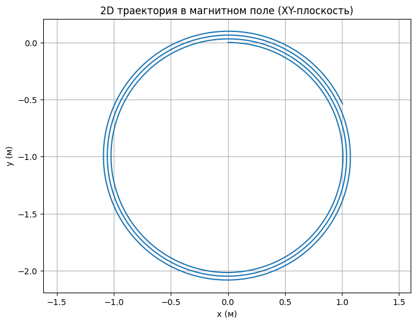
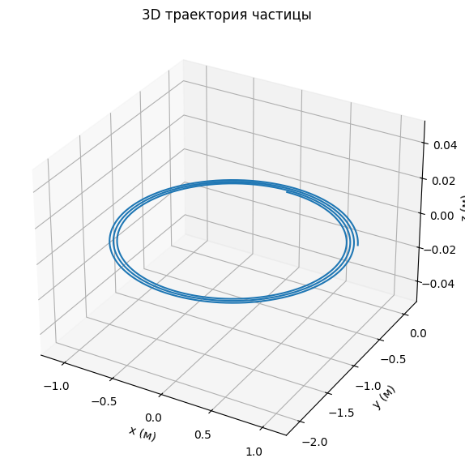

# Problem 1

# **Electromagnetism**  
## **Problem 1 — Simulation of the Lorentz Force**

---

## 🌟 Motivation

The **Lorentz force** governs how a charged particle moves through **electric** and **magnetic fields**. Understanding this phenomenon is essential in a wide range of scientific and engineering applications:

- ⚛ **Particle Accelerators** — Guide and speed up particles using magnetic fields.  
- 🧪 **Mass Spectrometry** — Identify chemical substances by separating ions by mass and charge.  
- 🔥 **Plasma Confinement** — Trap hot plasma in devices for nuclear fusion (e.g., Tokamaks).  
- 🌌 **Space Physics** — Explain how charged particles (like solar wind) interact with magnetic fields in space.

The Lorentz force is described by the equation:

### **𝐅 = q(𝐄 + 𝐯 × 𝐁)**

Where:  
- **𝐅** — Lorentz force  
- **q** — Particle charge  
- **𝐄** — Electric field vector  
- **𝐯** — Particle velocity  
- **𝐁** — Magnetic field vector  
- **×** — Cross product

---

## ⚙️ 1. Applications of the Lorentz Force

### 🧭 Real-World Examples:
- **Cyclotrons** use magnetic fields to spiral particles at high speeds.
- **Mass spectrometers** rely on Lorentz force to sort ions.
- **Fusion reactors** contain plasma using powerful magnetic traps.
- **Satellites and space probes** analyze particle motion in Earth’s magnetosphere.

### 🔍 Roles of Fields:
- **Electric field (𝐄)** accelerates or slows the particle.  
- **Magnetic field (𝐁)** bends the trajectory, causing circular or spiral paths.

---

## 🧮 2. Simulating Particle Motion

We will explore different field configurations:

- **Only Magnetic Field**  
- **Parallel Electric and Magnetic Fields**  
- **Perpendicular (Crossed) Fields**

To simulate motion, we’ll use **numerical methods** like the **Euler method** to compute the particle’s trajectory step by step.

---

## 🎛 3. Parameters to Explore

To understand the system behavior, we’ll vary the following:

- 🔌 **Electric Field Strength (𝐄)**  
- 🧲 **Magnetic Field Strength (𝐁)**  
- 🚀 **Initial Velocity (𝐯)**  
- ⚡ **Charge (q)**  
- ⚖️ **Mass (m)**

These parameters affect:

- The **radius** of circular motion  
- The **drift speed** of the particle in crossed fields  
- The **acceleration or deflection** of the path

---

## 📈 4. Visualization

We'll build **2D and 3D plots** of particle trajectories to visualize motion under various conditions.

### ✨ Key Physical Quantities:

- **Larmor Radius** (circular orbit in magnetic field):  
  \[
  r = $\frac{m \cdot v}{q \cdot B}$
  \]

- **Drift Velocity** in crossed electric and magnetic fields:  
  \[
  $\vec{v}_{\text{drift}} = \frac{\vec{E} \times \vec{B}}{B^2}$
  \]

These plots will illustrate how particles spiral, drift, and accelerate depending on the field setup.

---

[Visit My Collab](https://colab.research.google.com/drive/1sFJ5APtXlwNWeYUIvaAIGCzSz6Js5_gf#scrollTo=yQyUvuFT1zkR)