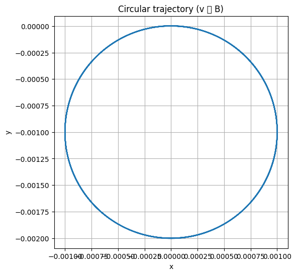
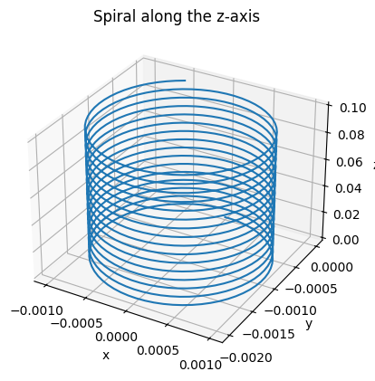
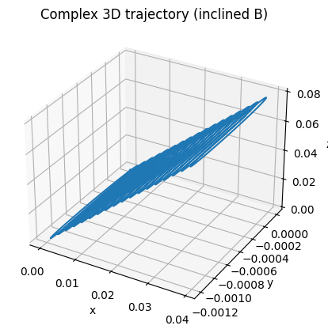

# Problem 1

# **Electromagnetism**  
## **Problem 1 — Simulation of the Lorentz Force**

---

## 🌟 Motivation

The **Lorentz force** governs how a charged particle moves through **electric** and **magnetic fields**. Understanding this phenomenon is essential in a wide range of scientific and engineering applications:

- ⚛ **Particle Accelerators** — Guide and speed up particles using magnetic fields.  
- 🧪 **Mass Spectrometry** — Identify chemical substances by separating ions by mass and charge.  
- 🔥 **Plasma Confinement** — Trap hot plasma in devices for nuclear fusion (e.g., Tokamaks).  
- 🌌 **Space Physics** — Explain how charged particles (like solar wind) interact with magnetic fields in space.

---

## ⚡ Electromagnetism Problem: Lorentz Force

## Given:
- **Charge:** $q = 1\ \text{C}$
- **Mass:** $m = 1\ \text{g} = 0.001\ \text{kg}$

---

## 1. Theory: Lorentz Force

The Lorentz force is defined as:

$$
\vec{F} = q(\vec{E} + \vec{v} \times \vec{B})
$$

Where:

- $\vec{F}$ — force acting on the charge,
- $q$ — charge,
- $\vec{E}$ — electric field vector,
- $\vec{B}$ — magnetic field vector,
- $\vec{v}$ — velocity of the particle.




# 📌 Circular Trajectory of a Charged Particle

This plot shows the **circular trajectory** of a charged particle in a **uniform magnetic field** when its velocity is **perpendicular** to the magnetic field direction.  
This is a classic case of motion governed by the **Lorentz force**.

---

## ⚙️ Initial Configuration

- **Initial position:**

  $$
  \vec{r}_0 = (0,\ 0,\ 0)
  $$

- **Initial velocity (perpendicular to the field):**

  $$
  \vec{v}_0 = v_x\,\hat{x}
  $$

- **Magnetic field (along the $z$-axis):**

  $$
  \vec{B} = B\,\hat{z}
  $$

---

## ⚛️ Key Insight

When the velocity is **perpendicular** to the magnetic field ($\vec{v} \perp \vec{B}$), the particle experiences a **centripetal Lorentz force**:

$$
\vec{F} = q\,(\vec{v} \times \vec{B})
$$

This force causes the particle to move in a **circular path** in the plane **perpendicular to** $\vec{B}$ (i.e., the **$x$–$y$ plane**).

- No motion occurs along the magnetic field direction
- The radius of the circular path is given by:

  $$
  R = \frac{mv}{|q|B}
  $$

---

### 🧪 Applications

- Cyclotron motion
- Magnetic confinement in plasma devices
- Basic model for gyration in space physics

---


``` python
# КРУГОВАЯ ТРАЕКТОРИЯ
import numpy as np
from scipy.integrate import solve_ivp
import matplotlib.pyplot as plt

# Параметры
q = 1  # Кл
m = 0.001  # кг
qm = q / m

# Уравнения Лоренца
def lorentz_rhs(t, y):
    vx, vy, vz = y[3:]
    B = np.array([0, 0, 1])  # Магнитное поле вдоль z
    v = np.array([vx, vy, vz])
    dvdt = qm * np.cross(v, B)
    return [vx, vy, vz, *dvdt]

# Начальные условия: положение и скорость
y0 = [0, 0, 0, 1, 0, 0]  # v вдоль x, B вдоль z

# Временной интервал
t_span = (0, 0.05)
t_eval = np.linspace(*t_span, 1000)

# Решение ОДУ
sol = solve_ivp(lorentz_rhs, t_span, y0, t_eval=t_eval)

# График
plt.figure(figsize=(6,6))
plt.plot(sol.y[0], sol.y[1])
plt.xlabel('x')
plt.ylabel('y')
plt.title('Circular trajectory (v ⟂ B)')
plt.axis('equal')
plt.grid(True)
plt.show()
```

---

## 2. Equation of Motion

From Newton's second law:

$$
m \frac{d\vec{v}}{dt} = q(\vec{E} + \vec{v} \times \vec{B})
$$

Dividing both sides by mass $m$:

$$
\frac{d\vec{v}}{dt} = \frac{q}{m}(\vec{E} + \vec{v} \times \vec{B})
$$



# 📌 Spiral Motion Along the **z**-Axis

The graph shows the **spiral trajectory** of a charged particle in a **magnetic field** directed along the **z-axis**. This type of motion is typical for charged particles in **magnetic traps** and in **plasma physics**.

---

## ⚙️ Initial Conditions

- **Initial position:**

  $$
\vec{r}_0 = (0,\ 0,\ 0)
  $$

- **Velocity:**

$$
  \vec{v}_0 = v_{\perp} \, \hat{x} + v_{\parallel} \, \hat{z}
$$

- **Magnetic field:**

  $$
  \vec{B} = B \, \hat{z}
  $$

---

## 🔄 Motion Components

| Component         | Direction                 | Effect                                     |
|-------------------|----------------------------|--------------------------------------------|
| $v_{\perp}$       | Perpendicular to $\vec{B}$ | Circular motion (due to Lorentz force)     |
| $v_{\parallel}$   | Parallel to $\vec{B}$      | Translational motion along the $z$-axis    |

---

## 🌀 Resulting Trajectory

The combination of these two components leads to a **spiral (helical)** trajectory along the $z$-axis:

- The particle rotates in the $xOy$ plane
- Simultaneously moves along the $z$-axis
- Final path: a **helix along the magnetic field line**

---


[Visit My Colab](https://colab.research.google.com/drive/1yGPCk_v0ouBSo2W5vaFOOQtDYtBwbxed)

``` python
# СПИРАЛЬНАЯ ТРАЕКТОРИЯ ВДОЛЬ Z
import numpy as np
from scipy.integrate import solve_ivp
import matplotlib.pyplot as plt
from mpl_toolkits.mplot3d import Axes3D

q = 1  # Кл
m = 0.001  # кг
qm = q / m

def lorentz_rhs(t, y):
    vx, vy, vz = y[3:]
    B = np.array([0, 0, 1])  # B вдоль z
    v = np.array([vx, vy, vz])
    dvdt = qm * np.cross(v, B)
    return [vx, vy, vz, *dvdt]

y0 = [0, 0, 0, 1, 0, 1]  # v по x и по z

t_span = (0, 0.1)
t_eval = np.linspace(*t_span, 1000)

sol = solve_ivp(lorentz_rhs, t_span, y0, t_eval=t_eval)

fig = plt.figure()
ax = fig.add_subplot(111, projection='3d')
ax.plot(sol.y[0], sol.y[1], sol.y[2])
ax.set_xlabel('x')
ax.set_ylabel('y')
ax.set_zlabel('z')
ax.set_title('Spiral along the axis z')
plt.show()
```

---

## 3. Python Simulation (Scenarios)

We implement three scenarios to observe the resulting particle trajectories:

### a. Circular Trajectory

**Conditions:**
- $\vec{E} = 0$
- $\vec{B} = (0, 0, B)$ (along the $z$-axis)
- Initial velocity: $\vec{v}_0 = (v, 0, 0)$

**Expected result:** Circular motion in the $xy$-plane.

---

### b. Spiral Along the Z-axis

**Conditions:**
- $\vec{E} = 0$
- $\vec{B} = (0, 0, B)$
- Initial velocity: $\vec{v}_0 = (v, 0, v_z)$

**Expected result:** Helical (spiral) motion along the $z$-axis.

---

### c. Interesting Drift Trajectory

**Conditions:**
- $\vec{E} \ne 0$, $\vec{B} \ne 0$
- Example: $\vec{E} = (0, E, 0)$, $\vec{B} = (0, 0, B)$
- Initial velocity: $\vec{v}_0 = (v_x, 0, 0)$

**Expected result:** Complex drift motion due to both electric and magnetic fields (E×B drift).


# 📌 Complex 3D Trajectory in an Inclined Magnetic Field

The figure below illustrates a **complex helical trajectory** of a charged particle moving in a **uniform but inclined magnetic field**. Unlike simple circular or spiral motion along a principal axis, this path arises due to the interaction of velocity components and a magnetic field that is **not aligned** with the coordinate axes.

---

## ⚙️ Initial Configuration

- **Initial position:**

  $$
  \vec{r}_0 = (0,\ 0,\ 0)
  $$

- **Initial velocity:**

  $$
  \vec{v}_0 = v_x\,\hat{x} + v_y\,\hat{y} + v_z\,\hat{z}
  $$

- **Inclined magnetic field:**

  $$
  \vec{B} = B_x\,\hat{x} + B_y\,\hat{y} + B_z\,\hat{z}
  $$

---

## 🔍 Key Insight

In an **inclined magnetic field**, the particle exhibits **complex 3D motion**:

- **Circular motion** in the plane **perpendicular** to $\vec{B}$
- **Linear motion** **along** the direction of $\vec{B}$
- The combination produces a **helical (drift) trajectory** in 3D space

---

### 🧪 Physical Context

This type of motion is relevant to:

- **Space physics** (e.g., cosmic ray propagation)
- **Magnetic confinement** (e.g., in fusion devices)
- **Non-uniform or inclined field** analysis

---


[Visit My Colab](https://colab.research.google.com/drive/11LVY-oECIBTi-wBZgVslF2bd77V0VSkG)

``` python
# СЛОЖНАЯ ТРАЕКТОРИЯ В НАКЛОННОМ ПОЛЕ
import numpy as np
from scipy.integrate import solve_ivp
import matplotlib.pyplot as plt
from mpl_toolkits.mplot3d import Axes3D

q = 1
m = 0.001
qm = q / m

def lorentz_rhs(t, y):
    vx, vy, vz = y[3:]
    B = np.array([0.5, 0, 1])  # Наклонное поле
    v = np.array([vx, vy, vz])
    dvdt = qm * np.cross(v, B)
    return [vx, vy, vz, *dvdt]

y0 = [0, 0, 0, 1, 0, 0.5]  # скорость по x и z

t_span = (0, 0.1)
t_eval = np.linspace(*t_span, 1000)

sol = solve_ivp(lorentz_rhs, t_span, y0, t_eval=t_eval)

fig = plt.figure()
ax = fig.add_subplot(111, projection='3d')
ax.plot(sol.y[0], sol.y[1], sol.y[2])
ax.set_xlabel('x')
ax.set_ylabel('y')
ax.set_zlabel('z')
ax.set_title('Complex 3D trajectory (inclined B)')
plt.show()
```
