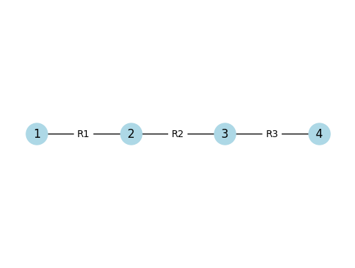
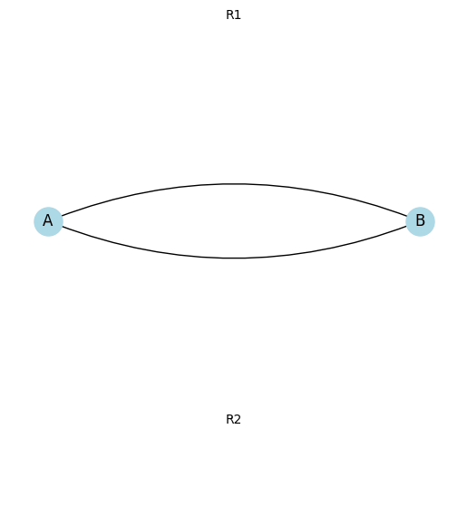
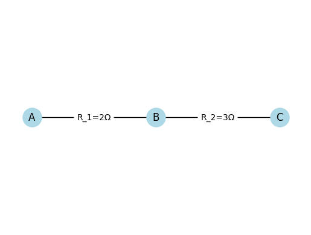
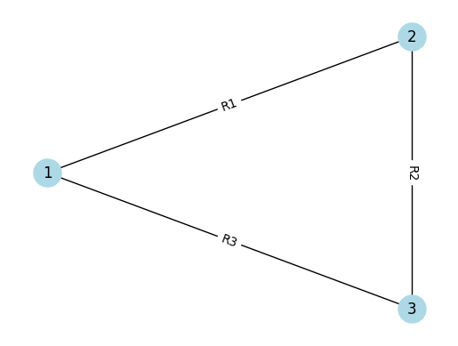
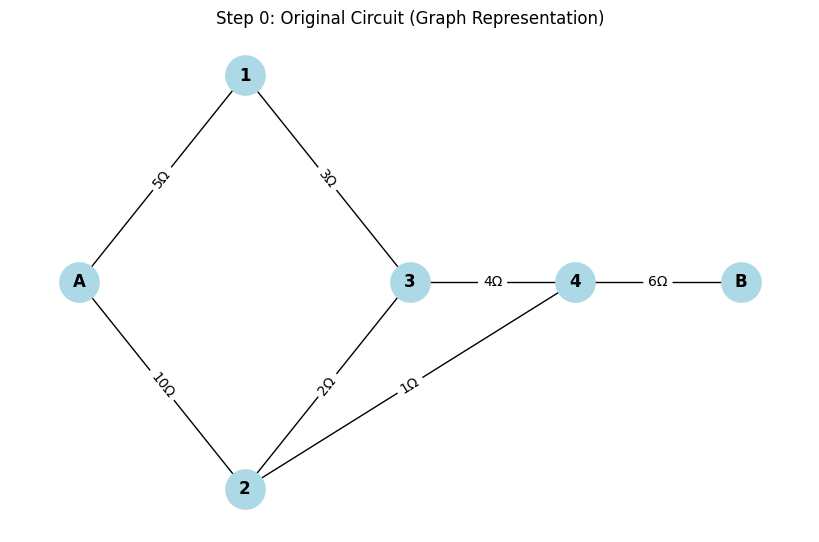
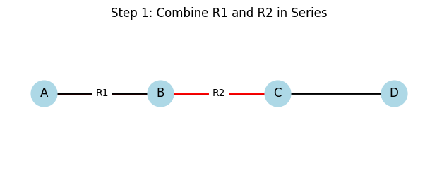
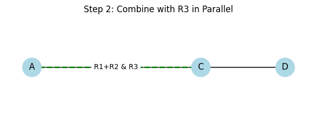
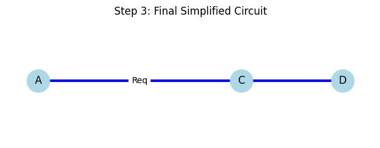
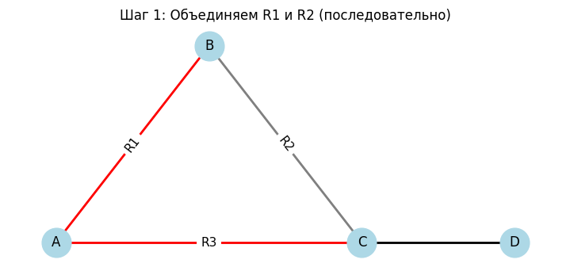

# Problem 1
# 🧠 Equivalent Resistance Using Graph Theory

## 📌 Introduction

Calculating equivalent resistance is a fundamental task in electrical engineering. For complex circuits, it’s easier to analyze them using graph theory, where:
- **Nodes** represent connection points.
- **Edges** represent resistors with weights equal to resistance values.

Graph representation enables:
- Automated calculations.
- Handling of nested configurations.
- Clear visualizations.

---

## 🔗 Series Connection

Resistors are connected **end-to-end**. Current is the same through all; voltages add up.

**Formula:**

$$
R_{eq} = R_1 + R_2 + \dots + R_n
$$

**Visualization in Python (Colab compatible):**



[Visit My Collab](https://colab.research.google.com/drive/1mecniYSjbo6Bq1a3tsMVI_4kCshRFlPw)

```python
import networkx as nx
import matplotlib.pyplot as plt

G = nx.Graph()
G.add_edge("1", "2", label="R1")
G.add_edge("2", "3", label="R2")
G.add_edge("3", "4", label="R3")
pos = {"1": (0,0), "2": (1,0), "3": (2,0), "4": (3,0)}

nx.draw_networkx_nodes(G, pos, node_color='lightblue', node_size=500)
nx.draw_networkx_labels(G, pos)
edge_labels = {(u, v): d['label'] for u, v, d in G.edges(data=True)}
nx.draw_networkx_edges(G, pos)
nx.draw_networkx_edge_labels(G, pos, edge_labels=edge_labels)
plt.axis('off')
plt.show()
```
## 🪄 Parallel Connection

Resistors are connected between the same two nodes. Voltage is the same across them; currents add up.

**Formula:**

$$
\frac{1}{R_{\text{eq}}} = \frac{1}{R_1} + \frac{1}{R_2} + \cdots + \frac{1}{R_n}
$$



[Visit My Collab](https://colab.research.google.com/drive/1FULioBWi2poCUVH18-9Xmo62p4xPh1jP)


``` python
import networkx as nx
import matplotlib.pyplot as plt

G = nx.MultiGraph()
G.add_edge("A", "B", label="R1")
G.add_edge("A", "B", label="R2")
pos = {"A": (0,0), "B": (2,0)}

nx.draw_networkx_nodes(G, pos, node_color='lightblue', node_size=500)
nx.draw_networkx_labels(G, pos)
nx.draw_networkx_edges(G, pos, edgelist=[("A", "B")], connectionstyle="arc3,rad=0.2")
nx.draw_networkx_edges(G, pos, edgelist=[("A", "B")], connectionstyle="arc3,rad=-0.2")
plt.text(1, 0.2, "R1", horizontalalignment='center')
plt.text(1, -0.2, "R2", horizontalalignment='center')
plt.axis('off')
plt.show()
```

## 🔗 Example 1: Simple Series

**Given:**

$R_1 = 2\,\Omega$, $R_2 = 3\,\Omega$, $R_3 = 5\,\Omega$

**Solution:**

$$
R_{\text{eq}} = 2 + 3 + 5 = 10\,\Omega
$$

**Visualization:**



[Visit My Collab](https://colab.research.google.com/drive/156DiWMIwDqDleeHBDCWUkJEyoMFbtdbB0)

``` python
import networkx as nx
import matplotlib.pyplot as plt

# Простая серия двух резисторов: R1=2Ω, R2=3Ω
G = nx.Graph()
G.add_edge("A", "B", label="R_1=2Ω")
G.add_edge("B", "C", label="R_2=3Ω")
pos = {"A": (0,0), "B": (1,0), "C": (2,0)}

nx.draw_networkx_nodes(G, pos, node_color='lightblue', node_size=500)
nx.draw_networkx_labels(G, pos)
edges = G.edges(data=True)
edge_labels = { (u, v):d['label'] for u,v,d in edges }
nx.draw_networkx_edges(G, pos)
nx.draw_networkx_edge_labels(G, pos, edge_labels=edge_labels)
plt.axis('off')
plt.show()

```

## ⚡ Example 2: Simple Parallel

**Given:**

$R_1 = 4\,\Omega$, $R_2 = 6\,\Omega$

**Solution:**

$$
\frac{1}{R_{\text{eq}}} = \frac{1}{4} + \frac{1}{6} = \frac{5}{12} \Rightarrow R_{\text{eq}} = 2.4\,\Omega
$$

**Visualization:**

``` python
import networkx as nx
import matplotlib.pyplot as plt

G = nx.MultiGraph()
G.add_edge("A", "B", label="4Ω")
G.add_edge("A", "B", label="6Ω")
pos = {"A": (0,0), "B": (2,0)}

nx.draw_networkx_nodes(G, pos, node_color='lightblue', node_size=500)
nx.draw_networkx_labels(G, pos)
nx.draw_networkx_edges(G, pos, edgelist=[("A", "B")], connectionstyle="arc3,rad=0.2")
nx.draw_networkx_edges(G, pos, edgelist=[("A", "B")], connectionstyle="arc3,rad=-0.2")
plt.text(1, 0.2, "4Ω", horizontalalignment='center')
plt.text(1, -0.2, "6Ω", horizontalalignment='center')
plt.axis('off')
plt.show()
```

## 🔀 Example 3: Nested Configuration

**Structure:**

$R_1$ and $R_2$ are in series.  
Their combination is in parallel with $R_3$.

**Given:**

$R_1 = 5\,\Omega$, $R_2 = 5\,\Omega$, $R_3 = 10\,\Omega$

**Solution:**

**Series:**

$$
R_{12} = R_1 + R_2 = 5 + 5 = 10\,\Omega
$$

**Parallel:**

$$
\frac{1}{R_{\text{eq}}} = \frac{1}{R_{12}} + \frac{1}{R_3} = \frac{1}{10} + \frac{1}{10} = \frac{1}{5} \Rightarrow R_{\text{eq}} = 5\,\Omega
$$

**Visualization:**



[Visit My Collab](https://colab.research.google.com/drive/156DiWMIwDqDleeHBDCWUkJEyoMFbtdbB#scrollTo=oLb49Gz-6c-v)


``` python
import networkx as nx
import matplotlib.pyplot as plt

G = nx.Graph()
G.add_edge("1", "2", label="R1")
G.add_edge("2", "3", label="R2")
G.add_edge("1", "3", label="R3")
pos = {"1": (0,0), "2": (1,1), "3": (1,-1)}

nx.draw_networkx_nodes(G, pos, node_color='lightblue', node_size=500)
nx.draw_networkx_labels(G, pos)
edge_labels = {(u, v): d['label'] for u, v, d in G.edges(data=True)}
nx.draw_networkx_edges(G, pos)
nx.draw_networkx_edge_labels(G, pos, edge_labels=edge_labels)
plt.axis('off')
plt.show()
```

##  Circuit Reduction Algorithm (Pseudocode)

**1. Build a graph where:**  
- **Nodes** = connection points  
- **Edges** = resistors with resistance values

**2. While the graph is not simplified:**  
- Look for degree-2 nodes → **combine series resistors**:  
  $R = R_1 + R_2$  
- Look for multiple edges between two nodes → **combine in parallel**:  
  $$
  \frac{1}{R} = \frac{1}{R_1} + \frac{1}{R_2} + \cdots
  $$

**3. Repeat until only one edge remains → equivalent resistance.**

---

## 🧠 Conclusion

Graph theory allows **automated and visual circuit analysis**.

Complex networks can be **reduced step-by-step** to one equivalent value.

Ideal for **simulations**, **optimization tasks**, and **learning purposes**.

---
---
---

# 🔌 Circuits Problem: Resistor Network Simplification

## ⚙️ Step 1: Problem Setup

We are given a circuit represented as a **graph**, consisting of:

- **Start terminal:** `A`
- **End terminal:** `B`
- **Intermediate nodes:** multiple points connected with resistors

### 🎯 Goal:
Simplify the resistor network and find the **equivalent resistance** $R_{\text{eq}}$ between **A** and **B** using step-by-step transformations.

---

## Step 2: Methods of Simplification

We will use the following simplification rules:

### ➕ Series Combination:
Resistors in series add up:

$$
R_{\text{eq}} = R_1 + R_2 + \cdots + R_n
$$

### ➗ Parallel Combination:
For resistors in parallel:

$$
\frac{1}{R_{\text{eq}}} = \frac{1}{R_1} + \frac{1}{R_2} + \cdots + \frac{1}{R_n}
$$

### 🔁 Y–Δ Transformation:
Used when a circuit contains **triangle ($\Delta$)** or **star ($Y$)** shapes that can’t be reduced by simple rules.

---

## 🪄 Step 3: Visualization of Steps

Each step shows:

- ✅ The **original circuit**
- 🔴 Highlighted resistors to be simplified
- 🟢 The **simplified version**
- 🔢 Clear numbering of each transformation

---

### 🧩 Step 1: Combine A–1 and 1–3 (Series)

- Highlight: `A–1 (5Ω)` and `1–3 (3Ω)`
- These are in **series**, so:

$$
R_{\text{eq}} = 5\ \Omega + 3\ \Omega = 8\ \Omega
$$

- Replace with edge: **A–3 (8Ω)**


---

### 🧩 Step 2: Combine 2–3 and A–2 (Parallel)

- Highlight: `A–2 (10Ω)` and `2–3 (2Ω)`
- Combine **in parallel**:

$$
\frac{1}{R_{\text{eq}}} = \frac{1}{10} + \frac{1}{2} = \frac{6}{10} \Rightarrow R_{\text{eq}} = \frac{10}{6} \approx 1.67\ \Omega
$$

- Replace with: **A–3 (1.67Ω)** (after merging through node 2)


---

### 🧩 Step 3: Combine in Series with 3–4 (4Ω)

- Highlight: previous equivalent `A–3` with `3–4`
- New resistance:

$$
R = 1.67\ \Omega + 4\ \Omega = 5.67\ \Omega
$$


---

### 🧩 Step 4: Add Path via 2–4 (1Ω), Apply Parallel Rule

- Now we have **two paths from A to 4**:
  - `A → 3 → 4` (5.67Ω)
  - `A → 2 → 4` (1Ω)
- Combine in **parallel**:

$$
\frac{1}{R_{\text{eq}}} = \frac{1}{5.67} + \frac{1}{1} \approx 1.176\ \Omega
$$


---

### 🧩 Step 5: Combine with 4–B (6Ω)

- Final series connection to B:

$$
R_{\text{total}} = 1.176\ \Omega + 6\ \Omega \approx \boxed{7.18\ \Omega}
$$

---


---

## 📦 Final Answer:

**Equivalent Resistance between A and B:**

$$
\boxed{R_{\text{eq}} = 7.18\ \Omega}
$$

---




[Visit My Colab](https://colab.research.google.com/drive/1hQBy5Z7NLXKtdlR65DiOjcUy4eC1zF9b)


``` python
import networkx as nx
import matplotlib.pyplot as plt

# Create the graph (example of a complex resistor network)
G = nx.Graph()

# Add nodes
nodes = ['A', '1', '2', '3', '4', 'B']
G.add_nodes_from(nodes)

# Add edges with resistor values as labels
edges = [
    ('A', '1', 5),
    ('A', '2', 10),
    ('1', '3', 3),
    ('2', '3', 2),
    ('3', '4', 4),
    ('4', 'B', 6),
    ('2', '4', 1)
]

for u, v, r in edges:
    G.add_edge(u, v, resistance=r)

# Draw the graph
pos = {
    'A': (0, 1),
    '1': (1, 2),
    '2': (1, 0),
    '3': (2, 1),
    '4': (3, 1),
    'B': (4, 1)
}

edge_labels = nx.get_edge_attributes(G, 'resistance')

plt.figure(figsize=(8, 5))
nx.draw(G, pos, with_labels=True, node_color='lightblue', node_size=800, font_weight='bold')
nx.draw_networkx_edge_labels(G, pos, edge_labels={(u, v): f"{d}Ω" for (u, v), d in edge_labels.items()})
plt.title("Step 0: Original Circuit (Graph Representation)")
plt.axis('off')
plt.show()
```
---





[Visit My Colab](https://colab.research.google.com/drive/1onCj748cPiKifULpypyIKxVo3E-Zzqbr)


``` python
import matplotlib.pyplot as plt
import networkx as nx

def draw_step1():
    G = nx.Graph()
    G.add_edge('A', 'B', label='R1')
    G.add_edge('B', 'C', label='R2')
    G.add_edge('A', 'C', label='R3')  # Параллельная ветвь
    G.add_edge('C', 'D', label='')

    pos = {'A': (0, 1), 'B': (1, 1), 'C': (2, 1), 'D': (3, 1)}

    plt.figure(figsize=(6, 2))
    nx.draw(G, pos, with_labels=True, node_color='lightblue', node_size=700)

    # Цвета
    edge_colors = []
    for edge in G.edges():
        if edge == ('A', 'B') or edge == ('B', 'C'):
            edge_colors.append('red')  # Выделим R1 и R2
        else:
            edge_colors.append('black')

    nx.draw_networkx_edges(G, pos, edge_color=edge_colors, width=2)
    labels = nx.get_edge_attributes(G, 'label')
    nx.draw_networkx_edge_labels(G, pos, edge_labels=labels, font_size=10)
    plt.title("Step 1: Combine R1 and R2 in Series")
    plt.axis('off')
    plt.show()

def draw_step2():
    G = nx.Graph()
    G.add_edge('A', 'C', label='R1+R2')  # серия
    G.add_edge('A', 'C', label='R3')     # параллельно
    G.add_edge('C', 'D', label='')

    pos = {'A': (0, 1), 'C': (2, 1), 'D': (3, 1)}

    plt.figure(figsize=(6, 2))
    nx.draw(G, pos, with_labels=True, node_color='lightblue', node_size=700)

    # Покажем обе ветви отдельно
    nx.draw_networkx_edges(G, pos, edgelist=[('A', 'C')], edge_color='green', width=2, style='dashed')
    nx.draw_networkx_edges(G, pos, edgelist=[('C', 'D')], edge_color='black')

    # Укажем каждую метку вручную
    labels = {('A', 'C'): 'R1+R2 & R3'}
    nx.draw_networkx_edge_labels(G, pos, edge_labels=labels, font_size=10)

    plt.title("Step 2: Combine with R3 in Parallel")
    plt.axis('off')
    plt.show()

def draw_step3():
    G = nx.Graph()
    G.add_edge('A', 'C', label='Req')
    G.add_edge('C', 'D', label='')

    pos = {'A': (0, 1), 'C': (2, 1), 'D': (3, 1)}

    plt.figure(figsize=(6, 2))
    nx.draw(G, pos, with_labels=True, node_color='lightblue', node_size=700)
    nx.draw_networkx_edges(G, pos, edge_color='blue', width=3)
    labels = nx.get_edge_attributes(G, 'label')
    nx.draw_networkx_edge_labels(G, pos, edge_labels=labels, font_size=10)
    plt.title("Step 3: Final Simplified Circuit")
    plt.axis('off')
    plt.show()

# Вызов всех шагов
draw_step1()
draw_step2()
draw_step3()
```
---



[Visit my html](https://akira-057.github.io/solutions_repo/1%20Physics/5%20Circuits/html/problem.Circuits.html)

[Visit My Colab](https://colab.research.google.com/drive/1Hwq_705VVshzwhTy8VPFkzuEyY7YOewS)

``` python
import matplotlib.pyplot as plt
import networkx as nx
import ipywidgets as widgets
from IPython.display import display

def plot_step(step):
    G = nx.Graph()

    if step == 1:
        # Шаг 1: начальная схема
        pos = {'A': (0, 1), 'B': (1, 1.3), 'C': (2, 1), 'D': (3, 1)}
        G.add_edge('A', 'B')
        G.add_edge('B', 'C')
        G.add_edge('A', 'C')  # R3
        G.add_edge('C', 'D')

        labels = {('A', 'B'): 'R1', ('B', 'C'): 'R2', ('A', 'C'): 'R3'}
        colors = ['red', 'red', 'gray', 'black']
        title = "Шаг 1: Объединяем R1 и R2 (последовательно)"

    elif step == 2:
        # Шаг 2: параллельное соединение R3 и (R1+R2)
        pos = {'A': (0, 1), 'X': (1, 1.6), 'Y': (1, 0.4), 'C': (2, 1), 'D': (3, 1)}
        G.add_edge('A', 'X')
        G.add_edge('X', 'C')
        G.add_edge('A', 'Y')
        G.add_edge('Y', 'C')
        G.add_edge('C', 'D')

        labels = {('A', 'X'): 'R1+R2', ('A', 'Y'): 'R3'}
        colors = ['green', 'green', 'red', 'red', 'black']
        title = "Шаг 2: Параллель R3 и (R1+R2)"

    else:
        # Шаг 3: финальная схема
        pos = {'A': (0, 1), 'C': (2, 1), 'D': (3, 1)}
        G.add_edge('A', 'C')
        G.add_edge('C', 'D')

        labels = {('A', 'C'): 'Req'}
        colors = ['blue', 'black']
        title = "Шаг 3: Финальная схема"

    plt.figure(figsize=(7, 3))
    nx.draw(G, pos, with_labels=True, node_color='lightblue', node_size=700)
    nx.draw_networkx_edges(G, pos, edge_color=colors, width=2)
    nx.draw_networkx_edge_labels(G, pos, edge_labels=labels, font_size=11)
    plt.title(title)
    plt.axis('off')
    plt.show()

    # ⬅️ Запускаем интерактивный слайдер (переключение шагов)
widgets.interact(plot_step, step=widgets.IntSlider(min=1, max=3, step=1, value=1))

plt.show()  # Эта строка выводит только график
```

