# Problem 1
# 🧠 Equivalent Resistance Using Graph Theory

## 📌 Introduction

Calculating equivalent resistance is a fundamental task in electrical engineering. For complex circuits, it’s easier to analyze them using graph theory, where:
- **Nodes** represent connection points.
- **Edges** represent resistors with weights equal to resistance values.

Graph representation enables:
- Automated calculations.
- Handling of nested configurations.
- Clear visualizations.

---

## 🔗 Series Connection

Resistors are connected **end-to-end**. Current is the same through all; voltages add up.

**Formula:**

$$
R_{eq} = R_1 + R_2 + \dots + R_n
$$

**Visualization in Python (Colab compatible):**


[Visit My Collab](https://colab.research.google.com/drive/1mecniYSjbo6Bq1a3tsMVI_4kCshRFlPw)

```python
import networkx as nx
import matplotlib.pyplot as plt

G = nx.Graph()
G.add_edge("1", "2", label="R1")
G.add_edge("2", "3", label="R2")
G.add_edge("3", "4", label="R3")
pos = {"1": (0,0), "2": (1,0), "3": (2,0), "4": (3,0)}

nx.draw_networkx_nodes(G, pos, node_color='lightblue', node_size=500)
nx.draw_networkx_labels(G, pos)
edge_labels = {(u, v): d['label'] for u, v, d in G.edges(data=True)}
nx.draw_networkx_edges(G, pos)
nx.draw_networkx_edge_labels(G, pos, edge_labels=edge_labels)
plt.axis('off')
plt.show()
```
## 🪄 Parallel Connection

Resistors are connected between the same two nodes. Voltage is the same across them; currents add up.

**Formula:**

$$
\frac{1}{R_{\text{eq}}} = \frac{1}{R_1} + \frac{1}{R_2} + \cdots + \frac{1}{R_n}
$$


[Visit My Collab](https://colab.research.google.com/drive/1FULioBWi2poCUVH18-9Xmo62p4xPh1jP)


``` python
import networkx as nx
import matplotlib.pyplot as plt

G = nx.MultiGraph()
G.add_edge("A", "B", label="R1")
G.add_edge("A", "B", label="R2")
pos = {"A": (0,0), "B": (2,0)}

nx.draw_networkx_nodes(G, pos, node_color='lightblue', node_size=500)
nx.draw_networkx_labels(G, pos)
nx.draw_networkx_edges(G, pos, edgelist=[("A", "B")], connectionstyle="arc3,rad=0.2")
nx.draw_networkx_edges(G, pos, edgelist=[("A", "B")], connectionstyle="arc3,rad=-0.2")
plt.text(1, 0.2, "R1", horizontalalignment='center')
plt.text(1, -0.2, "R2", horizontalalignment='center')
plt.axis('off')
plt.show()
```

## 🔗 Example 1: Simple Series

**Given:**

$R_1 = 2\,\Omega$, $R_2 = 3\,\Omega$, $R_3 = 5\,\Omega$

**Solution:**

$$
R_{\text{eq}} = 2 + 3 + 5 = 10\,\Omega
$$

**Visualization:**


[Visit My Collab](https://colab.research.google.com/drive/156DiWMIwDqDleeHBDCWUkJEyoMFbtdbB0)

``` python
import networkx as nx
import matplotlib.pyplot as plt

# Простая серия двух резисторов: R1=2Ω, R2=3Ω
G = nx.Graph()
G.add_edge("A", "B", label="R_1=2Ω")
G.add_edge("B", "C", label="R_2=3Ω")
pos = {"A": (0,0), "B": (1,0), "C": (2,0)}

nx.draw_networkx_nodes(G, pos, node_color='lightblue', node_size=500)
nx.draw_networkx_labels(G, pos)
edges = G.edges(data=True)
edge_labels = { (u, v):d['label'] for u,v,d in edges }
nx.draw_networkx_edges(G, pos)
nx.draw_networkx_edge_labels(G, pos, edge_labels=edge_labels)
plt.axis('off')
plt.show()

```

## ⚡ Example 2: Simple Parallel

**Given:**

$R_1 = 4\,\Omega$, $R_2 = 6\,\Omega$

**Solution:**

$$
\frac{1}{R_{\text{eq}}} = \frac{1}{4} + \frac{1}{6} = \frac{5}{12} \Rightarrow R_{\text{eq}} = 2.4\,\Omega
$$

**Visualization:**

``` python
import networkx as nx
import matplotlib.pyplot as plt

G = nx.MultiGraph()
G.add_edge("A", "B", label="4Ω")
G.add_edge("A", "B", label="6Ω")
pos = {"A": (0,0), "B": (2,0)}

nx.draw_networkx_nodes(G, pos, node_color='lightblue', node_size=500)
nx.draw_networkx_labels(G, pos)
nx.draw_networkx_edges(G, pos, edgelist=[("A", "B")], connectionstyle="arc3,rad=0.2")
nx.draw_networkx_edges(G, pos, edgelist=[("A", "B")], connectionstyle="arc3,rad=-0.2")
plt.text(1, 0.2, "4Ω", horizontalalignment='center')
plt.text(1, -0.2, "6Ω", horizontalalignment='center')
plt.axis('off')
plt.show()
```

## 🔀 Example 3: Nested Configuration

**Structure:**

$R_1$ and $R_2$ are in series.  
Their combination is in parallel with $R_3$.

**Given:**

$R_1 = 5\,\Omega$, $R_2 = 5\,\Omega$, $R_3 = 10\,\Omega$

**Solution:**

**Series:**

$$
R_{12} = R_1 + R_2 = 5 + 5 = 10\,\Omega
$$

**Parallel:**

$$
\frac{1}{R_{\text{eq}}} = \frac{1}{R_{12}} + \frac{1}{R_3} = \frac{1}{10} + \frac{1}{10} = \frac{1}{5} \Rightarrow R_{\text{eq}} = 5\,\Omega
$$

**Visualization:**


[Visit My Collab](https://colab.research.google.com/drive/156DiWMIwDqDleeHBDCWUkJEyoMFbtdbB#scrollTo=oLb49Gz-6c-v)


``` python
import networkx as nx
import matplotlib.pyplot as plt

G = nx.Graph()
G.add_edge("1", "2", label="R1")
G.add_edge("2", "3", label="R2")
G.add_edge("1", "3", label="R3")
pos = {"1": (0,0), "2": (1,1), "3": (1,-1)}

nx.draw_networkx_nodes(G, pos, node_color='lightblue', node_size=500)
nx.draw_networkx_labels(G, pos)
edge_labels = {(u, v): d['label'] for u, v, d in G.edges(data=True)}
nx.draw_networkx_edges(G, pos)
nx.draw_networkx_edge_labels(G, pos, edge_labels=edge_labels)
plt.axis('off')
plt.show()
```

##  Circuit Reduction Algorithm (Pseudocode)

**1. Build a graph where:**  
- **Nodes** = connection points  
- **Edges** = resistors with resistance values

**2. While the graph is not simplified:**  
- Look for degree-2 nodes → **combine series resistors**:  
  $R = R_1 + R_2$  
- Look for multiple edges between two nodes → **combine in parallel**:  
  $$
  \frac{1}{R} = \frac{1}{R_1} + \frac{1}{R_2} + \cdots
  $$

**3. Repeat until only one edge remains → equivalent resistance.**

---

## 🧠 Conclusion

Graph theory allows **automated and visual circuit analysis**.

Complex networks can be **reduced step-by-step** to one equivalent value.

Ideal for **simulations**, **optimization tasks**, and **learning purposes**.

---
---
---

# 🔌 Circuits Problem: Resistor Network Simplification

## ⚙️ Step 1: Problem Setup

We are given a circuit represented as a **graph**, consisting of:

- **Start terminal:** `A`
- **End terminal:** `B`
- **Intermediate nodes:** multiple points connected with resistors

### 🎯 Goal:
Simplify the resistor network and find the **equivalent resistance** $R_{\text{eq}}$ between **A** and **B** using step-by-step transformations.

---

## Step 2: Methods of Simplification

We will use the following simplification rules:

### ➕ Series Combination:
Resistors in series add up:

$$
R_{\text{eq}} = R_1 + R_2 + \cdots + R_n
$$

### ➗ Parallel Combination:
For resistors in parallel:

$$
\frac{1}{R_{\text{eq}}} = \frac{1}{R_1} + \frac{1}{R_2} + \cdots + \frac{1}{R_n}
$$

### 🔁 Y–Δ Transformation:
Used when a circuit contains **triangle ($\Delta$)** or **star ($Y$)** shapes that can’t be reduced by simple rules.

---

## 🪄 Step 3: Visualization of Steps

Each step shows:

- ✅ The **original circuit**
- 🔴 Highlighted resistors to be simplified
- 🟢 The **simplified version**
- 🔢 Clear numbering of each transformation

---

### 🧩 Step 1: Combine A–1 and 1–3 (Series)

- Highlight: `A–1 (5Ω)` and `1–3 (3Ω)`
- These are in **series**, so:

$$
R_{\text{eq}} = 5\ \Omega + 3\ \Omega = 8\ \Omega
$$

- Replace with edge: **A–3 (8Ω)**


---

### 🧩 Step 2: Combine 2–3 and A–2 (Parallel)

- Highlight: `A–2 (10Ω)` and `2–3 (2Ω)`
- Combine **in parallel**:

$$
\frac{1}{R_{\text{eq}}} = \frac{1}{10} + \frac{1}{2} = \frac{6}{10} \Rightarrow R_{\text{eq}} = \frac{10}{6} \approx 1.67\ \Omega
$$

- Replace with: **A–3 (1.67Ω)** (after merging through node 2)


---

### 🧩 Step 3: Combine in Series with 3–4 (4Ω)

- Highlight: previous equivalent `A–3` with `3–4`
- New resistance:

$$
R = 1.67\ \Omega + 4\ \Omega = 5.67\ \Omega
$$


---

### 🧩 Step 4: Add Path via 2–4 (1Ω), Apply Parallel Rule

- Now we have **two paths from A to 4**:
  - `A → 3 → 4` (5.67Ω)
  - `A → 2 → 4` (1Ω)
- Combine in **parallel**:

$$
\frac{1}{R_{\text{eq}}} = \frac{1}{5.67} + \frac{1}{1} \approx 1.176\ \Omega
$$


---

### 🧩 Step 5: Combine with 4–B (6Ω)

- Final series connection to B:

$$
R_{\text{total}} = 1.176\ \Omega + 6\ \Omega \approx \boxed{7.18\ \Omega}
$$

---


---

## 📦 Final Answer:

**Equivalent Resistance between A and B:**

$$
\boxed{R_{\text{eq}} = 7.18\ \Omega}
$$

---
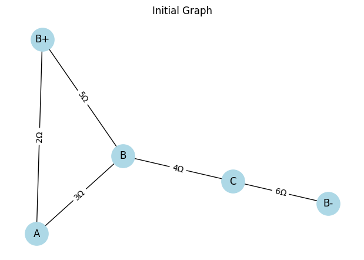
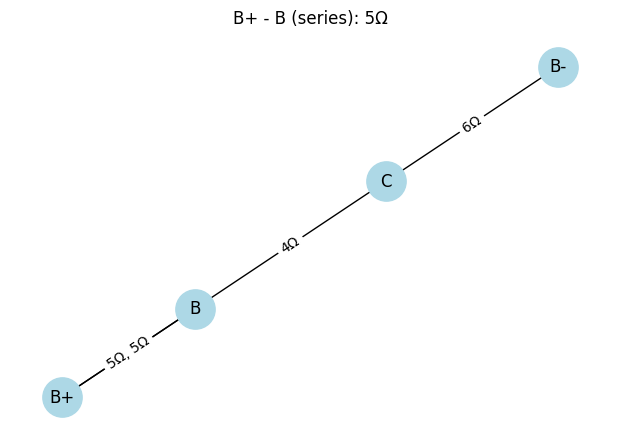

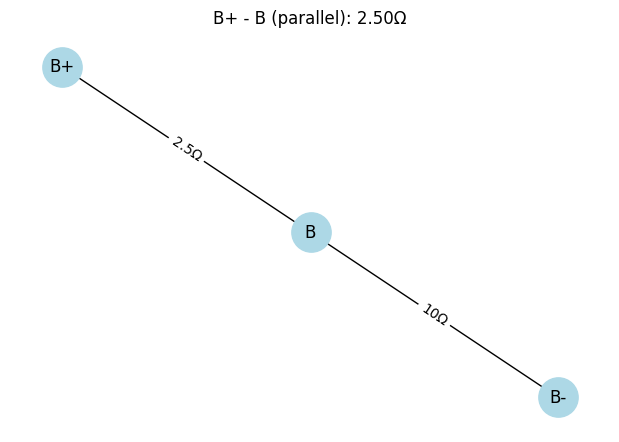
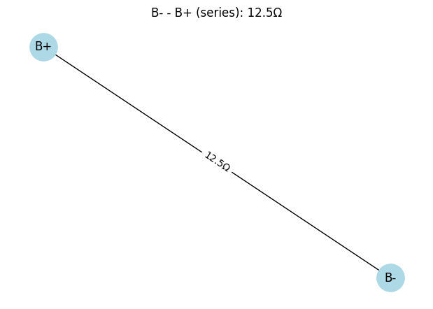
Equivalent Resistance (Case 1): 12.50 Ohms

[Visit My Colab](https://colab.research.google.com/drive/1xuguB5GX1W-mUATxRGEySZYFuOlGphAo)

``` python
import networkx as nx
import matplotlib.pyplot as plt

def draw_graph(G, step_title):
    pos = nx.spring_layout(G, seed=42)
    plt.figure(figsize=(6, 4))
    edge_labels = {}
    for u, v, data in G.edges(data=True):
        label = f"{data['resistance']}Ω"
        if G.number_of_edges(u, v) > 1:
            label = ', '.join(f"{d['resistance']}Ω" for d in G.get_edge_data(u, v).values())
        edge_labels[(u, v)] = label
    nx.draw(G, pos, with_labels=True, node_color='lightblue', node_size=800)
    nx.draw_networkx_edge_labels(G, pos, edge_labels=edge_labels)
    plt.title(step_title)
    plt.show()

def combine_series(G):
    changed = True
    while changed:
        changed = False
        for node in list(G.nodes):
            if G.degree(node) == 2 and node not in ("B+", "B-"):
                neighbors = list(G.neighbors(node))
                if len(neighbors) == 2:
                    u, v = neighbors
                    # Find the two edges and their resistances
                    edge1 = next(iter(G.get_edge_data(u, node).values()))
                    edge2 = next(iter(G.get_edge_data(node, v).values()))
                    R_new = edge1['resistance'] + edge2['resistance']
                    G.remove_node(node)
                    G.add_edge(u, v, resistance=R_new)
                    changed = True
                    draw_graph(G, f"{u} - {v} (series): {R_new}Ω")
                    break

def combine_parallel(G):
    to_process = list(G.edges(keys=True))
    seen = set()
    for u, v, k in to_process:
        if (u, v) in seen or (v, u) in seen:
            continue
        if G.number_of_edges(u, v) > 1:
            resistances = [d['resistance'] for d in G.get_edge_data(u, v).values()]
            R_parallel = 1 / sum(1/r for r in resistances)
            G.remove_edges_from([(u, v, key) for key in G.get_edge_data(u, v).keys()])
            G.add_edge(u, v, resistance=R_parallel)
            draw_graph(G, f"{u} - {v} (parallel): {R_parallel:.2f}Ω")
        seen.add((u, v))

def reduce_graph(G):
    draw_graph(G, "Initial Graph")
    while True:
        nodes_before = len(G.nodes)
        combine_series(G)
        combine_parallel(G)
        if len(G.nodes) == nodes_before:
            break
    return G

def get_equivalent_resistance(G, source, target):
    if G.has_edge(source, target):
        return next(iter(G.get_edge_data(source, target).values()))['resistance']
    else:
        return None

def example_case_1():
    G = nx.MultiGraph()
    G.add_nodes_from(["B+", "B-", "A", "B", "C"])
    G.add_edge("B+", "A", resistance=2)  # R2
    G.add_edge("A", "B", resistance=3)   # R3
    G.add_edge("B+", "B", resistance=5)  # R1
    G.add_edge("B", "C", resistance=4)   # R4
    G.add_edge("C", "B-", resistance=6)  # R5

    reduce_graph(G)
    Req = get_equivalent_resistance(G, "B+", "B-")
    print(f"Equivalent Resistance (Case 1): {Req:.2f} Ohms")

example_case_1()
```
---

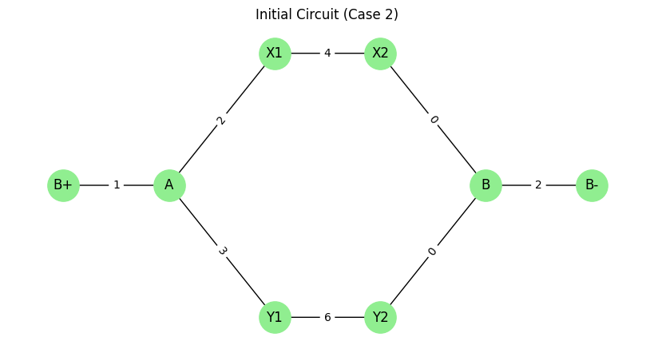

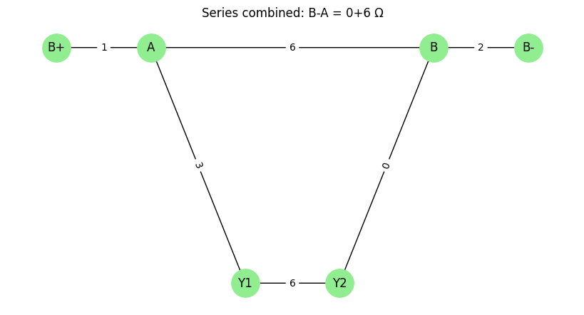
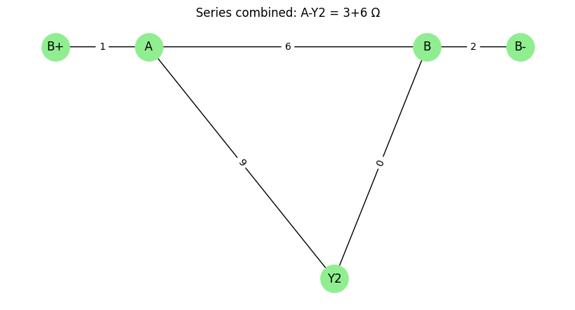
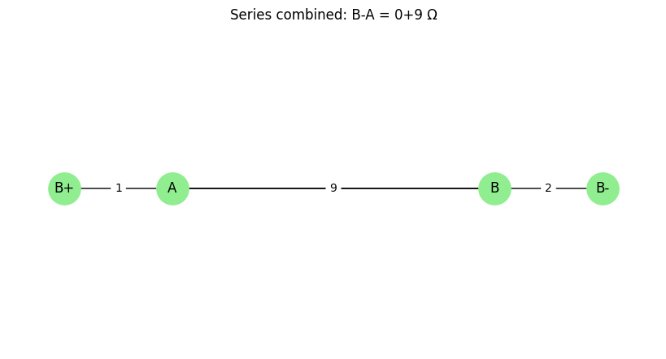
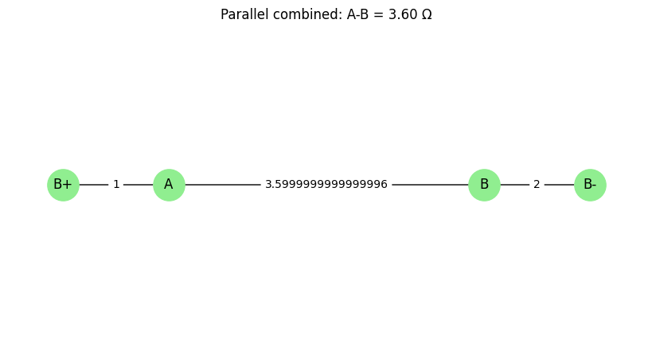
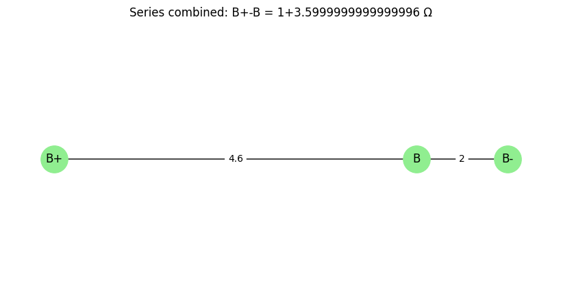
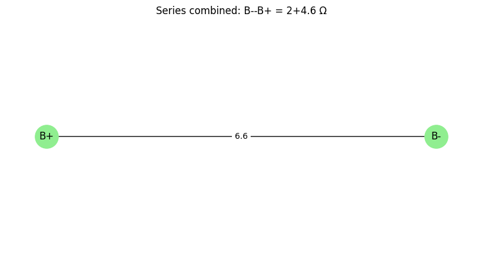
Equivalent Resistance (Case 2): 6.60 Ω

[Visit My Colab](https://colab.research.google.com/drive/1izFl9MdwZutic1o1vXm3KwhAO9tf_Jqr)

``` python
import networkx as nx
import matplotlib.pyplot as plt

# Ручные координаты как в Case 2
pos_case2 = {
    "B+": (0, 1),
    "A": (1, 1),
    "X1": (2, 2),  # верхний путь
    "X2": (3, 2),
    "Y1": (2, 0),  # нижний путь
    "Y2": (3, 0),
    "B": (4, 1),
    "B-": (5, 1)
}

def draw_case2(G, title):
    plt.figure(figsize=(8, 4))
    edge_labels = nx.get_edge_attributes(G, 'resistance')
    nx.draw(G, pos=pos_case2, with_labels=True, node_size=800, node_color='lightgreen')
    nx.draw_networkx_edge_labels(G, pos=pos_case2, edge_labels=edge_labels)
    plt.title(title)
    plt.axis('off')
    plt.show()

def combine_series_case2(G):
    changed = True
    while changed:
        changed = False
        for node in list(G.nodes):
            if node not in ("B+", "B-") and G.degree(node) == 2:
                u, v = list(G.neighbors(node))
                r1 = G.get_edge_data(u, node)[0]['resistance']
                r2 = G.get_edge_data(node, v)[0]['resistance']
                G.remove_node(node)
                G.add_edge(u, v, resistance=r1 + r2)
                draw_case2(G, f"Series combined: {u}-{v} = {r1}+{r2} Ω")
                changed = True
                break

def combine_parallel_case2(G):
    for u, v in list(G.edges()):
        if G.number_of_edges(u, v) > 1:
            resistances = [edata['resistance'] for k, edata in G[u][v].items()]
            R_parallel = 1 / sum(1/r for r in resistances)
            G.remove_edges_from([(u, v, k) for k in G[u][v]])
            G.add_edge(u, v, resistance=R_parallel)
            draw_case2(G, f"Parallel combined: {u}-{v} = {R_parallel:.2f} Ω")

def reduce_graph_case2(G):
    draw_case2(G, "Initial Circuit (Case 2)")
    while True:
        before = len(G.edges)
        combine_series_case2(G)
        combine_parallel_case2(G)
        if len(G.edges) == before:
            break

def get_equivalent_resistance(G, source, target):
    return list(G.get_edge_data(source, target).values())[0]['resistance']

def example_case_2():
    G = nx.MultiGraph()

    # Узлы
    G.add_nodes_from(["B+", "A", "X1", "X2", "Y1", "Y2", "B", "B-"])

    # Верхний путь: R2, R4
    G.add_edge("A", "X1", resistance=2)   # R2
    G.add_edge("X1", "X2", resistance=4)  # R4
    G.add_edge("X2", "B", resistance=0)   # соединение

    # Нижний путь: R3, R5
    G.add_edge("A", "Y1", resistance=3)   # R3
    G.add_edge("Y1", "Y2", resistance=6)  # R5
    G.add_edge("Y2", "B", resistance=0)   # соединение

    # Начало и конец
    G.add_edge("B+", "A", resistance=1)   # R1
    G.add_edge("B", "B-", resistance=2)   # R6

    reduce_graph_case2(G)
    Req = get_equivalent_resistance(G, "B+", "B-")
    print(f"Equivalent Resistance (Case 2): {Req:.2f} Ω")

example_case_2()
```
---

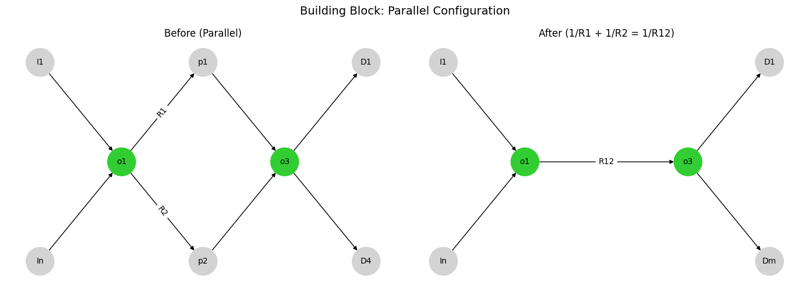

[Visit My Colab](https://colab.research.google.com/drive/12W7lCLVaxKMBX_hkdXIAOJcMU3NZQYju)

``` python
import networkx as nx
import matplotlib.pyplot as plt

def draw_parallel_config_full():
    fig, axs = plt.subplots(1, 2, figsize=(14, 5))

    # Общие параметры
    node_color_main = 'limegreen'
    node_color_io = 'lightgray'
    node_size = 1200
    font_size = 10

    # === До упрощения ===
    G1 = nx.DiGraph()
    G1.add_edges_from([
        ('I1', 'o1'), ('In', 'o1'),
        ('o1', 'p1', {'resistance': 'R1'}),
        ('p1', 'o3'),
        ('o1', 'p2', {'resistance': 'R2'}),
        ('p2', 'o3'),
        ('o3', 'D1'), ('o3', 'D4')
    ])
    pos1 = {
        'I1': (-1, 2), 'In': (-1, 0),
        'o1': (0, 1),
        'p1': (1, 2), 'p2': (1, 0),
        'o3': (2, 1),
        'D1': (3, 2), 'D4': (3, 0)
    }

    node_colors1 = [node_color_main if n in ['o1', 'o3'] else node_color_io for n in G1.nodes]
    nx.draw(G1, pos1, ax=axs[0], with_labels=True, node_color=node_colors1,
            node_size=node_size, font_size=font_size, arrows=True)
    edge_labels1 = nx.get_edge_attributes(G1, 'resistance')
    nx.draw_networkx_edge_labels(G1, pos1, edge_labels=edge_labels1, ax=axs[0])
    axs[0].set_title("Before (Parallel)")

    # === После упрощения ===
    G2 = nx.DiGraph()
    G2.add_edges_from([
        ('I1', 'o1'), ('In', 'o1'),
        ('o1', 'o3', {'resistance': 'R12'}),
        ('o3', 'D1'), ('o3', 'Dm')
    ])
    pos2 = {
        'I1': (-1, 2), 'In': (-1, 0),
        'o1': (0, 1), 'o3': (2, 1),
        'D1': (3, 2), 'Dm': (3, 0)
    }

    node_colors2 = [node_color_main if n in ['o1', 'o3'] else node_color_io for n in G2.nodes]
    nx.draw(G2, pos2, ax=axs[1], with_labels=True, node_color=node_colors2,
            node_size=node_size, font_size=font_size, arrows=True)
    edge_labels2 = nx.get_edge_attributes(G2, 'resistance')
    nx.draw_networkx_edge_labels(G2, pos2, edge_labels=edge_labels2, ax=axs[1])
    axs[1].set_title("After (1/R1 + 1/R2 = 1/R12)")

    for ax in axs:
        ax.axis('off')

    plt.suptitle("Building Block: Parallel Configuration", fontsize=14)
    plt.tight_layout()
    plt.show()

draw_parallel_config_full()
```

---

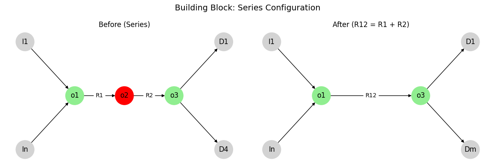

[Visit My Colab](https://colab.research.google.com/drive/1ZVcaHinWAY1pP4ZMUoyxuqSqv9GDCDqy)

``` python
import networkx as nx
import matplotlib.pyplot as plt

def draw_detailed_series_config():
    fig, axs = plt.subplots(1, 2, figsize=(12, 4))

    # Граф до упрощения
    G1 = nx.DiGraph()
    G1.add_edges_from([
        ('I1', 'o1'), ('In', 'o1'),
        ('o1', 'o2', {'resistance': 'R1'}),
        ('o2', 'o3', {'resistance': 'R2'}),
        ('o3', 'D1'), ('o3', 'D4')
    ])
    pos1 = {
        'I1': (-1, 2), 'In': (-1, 0),
        'o1': (0, 1), 'o2': (1, 1), 'o3': (2, 1),
        'D1': (3, 2), 'D4': (3, 0)
    }
    node_colors1 = ['red' if n == 'o2' else 'lightgray' if n.startswith('I') or n.startswith('D') else 'lightgreen' for n in G1.nodes]
    nx.draw(G1, pos=pos1, ax=axs[0], with_labels=True, node_size=1000, node_color=node_colors1)
    nx.draw_networkx_edge_labels(G1, pos=pos1, edge_labels=nx.get_edge_attributes(G1, 'resistance'), ax=axs[0])
    axs[0].set_title('Before (Series)')

    # Граф после упрощения
    G2 = nx.DiGraph()
    G2.add_edges_from([
        ('I1', 'o1'), ('In', 'o1'),
        ('o1', 'o3', {'resistance': 'R12'}),
        ('o3', 'D1'), ('o3', 'Dm')
    ])
    pos2 = {
        'I1': (-1, 2), 'In': (-1, 0),
        'o1': (0, 1), 'o3': (2, 1),
        'D1': (3, 2), 'Dm': (3, 0)
    }
    node_colors2 = ['lightgray' if n.startswith('I') or n.startswith('D') else 'lightgreen' for n in G2.nodes]
    nx.draw(G2, pos=pos2, ax=axs[1], with_labels=True, node_size=1000, node_color=node_colors2)
    nx.draw_networkx_edge_labels(G2, pos=pos2, edge_labels=nx.get_edge_attributes(G2, 'resistance'), ax=axs[1])
    axs[1].set_title('After (R12 = R1 + R2)')

    for ax in axs:
        ax.axis('off')

    plt.suptitle("Building Block: Series Configuration", fontsize=14)
    plt.tight_layout()
    plt.show()

draw_detailed_series_config()
```