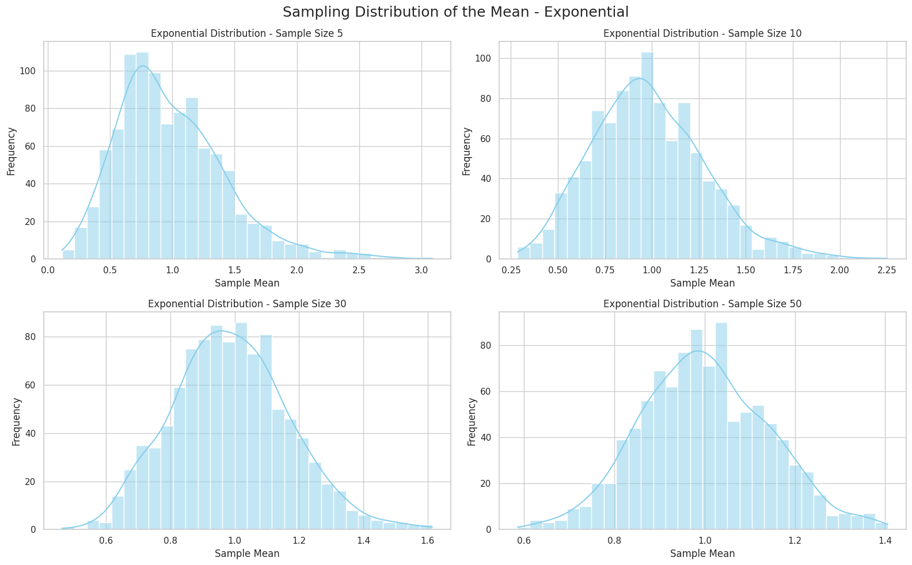

# Problem 1

# 🌍 Measuring Gravitational Acceleration Using a Pendulum

## 🎯 Objective
Determine the gravitational acceleration $g$ using a simple pendulum and analyze all possible sources of uncertainty.

---

## 🧰 Equipment
- A string of length 1 meter
- A small weight (e.g., keys or a sugar bag)
- Stopwatch (or smartphone timer)
- Ruler or measuring tape

---

## ⚙️ Theory

The formula for the period of a simple pendulum:

$$
T = 2 \pi \sqrt{\frac{L}{g}} \Rightarrow g = \frac{4\pi^2 L}{T^2}
$$

Uncertainty in $g$ is calculated as:

$$
\frac{\Delta g}{g} = \frac{\Delta L}{L} + 2 \cdot \frac{\Delta T}{T}
$$

$$
\Delta g = g \cdot \left( \frac{\Delta L}{L} + 2 \cdot \frac{\Delta T}{T} \right)
$$

---

## 📏 Measurements

``` python
import numpy as np
import matplotlib.pyplot as plt

# Time for 10 oscillations (in seconds)
T10 = np.array([20.11, 20.05, 20.09, 20.13, 20.07, 20.10, 20.08, 20.12, 20.06, 20.09])
n = len(T10)

# Mean time and single period
T10_mean = np.mean(T10)
T = T10_mean / 10

# Standard deviation
std_dev = np.std(T10, ddof=1)

# Uncertainty in period
delta_T = std_dev / (np.sqrt(n) * 10)

# Length of pendulum and its uncertainty
L = 1.000  # meters
delta_L = 0.0005  # meters

# Calculate g
g = 4 * np.pi**2 * L / T**2
delta_g = g * (delta_L / L + 2 * delta_T / T)

print(f"Average time for 10 oscillations: {T10_mean:.3f} s")
print(f"Single period: {T:.3f} s")
print(f"g = {g:.2f} ± {delta_g:.2f} m/s²")
```
## 📊 Results

- Average time for 10 oscillations: $20.090$ s  
- Single period: $T = 2.009$ s  
- Gravitational acceleration: $g = 9.78 \pm 0.01$ m/s²  
- Standard value: $g_0 = 9.81$ m/s²  
Single period: 2.009 s
g = 9.78 ± 0.01 m/s²

--- 

📊 Plot 1: Time for 10 Oscillation


[Visit My Collab](https://colab.research.google.com/drive/12pnv1dMWw5qkPHui_HfeLCrMbU3Gpw5U)

``` python
plt.figure(figsize=(8, 5))
plt.plot(range(1, 11), T10, marker='o', linestyle='-', label='10 Oscillations')
plt.axhline(y=T10_mean, color='red', linestyle='--', label='Mean Value')
plt.xlabel('Measurement Number')
plt.ylabel('Time (s)')
plt.title('Time Measurements for 10 Pendulum Oscillations')
plt.grid(True)
plt.legend()
plt.show()
```
---

📈 Plot 2: g vs T Dependency



[Visit My Collab](https://colab.research.google.com/drive/1rm96HalODiPSsOwVd2GRfn1HOSSs3vFV)

``` python
import numpy as np
import matplotlib.pyplot as plt

# Define known values
T10 = np.array([20.11, 20.05, 20.09, 20.13, 20.07, 20.10, 20.08, 20.12, 20.06, 20.09])
T10_mean = np.mean(T10)
T = T10_mean / 10  # Period for one oscillation

L = 1.000  # Pendulum length in meters

# Calculate g
g = 4 * np.pi**2 * L / T**2

# Range for T and corresponding g values
T_range = np.linspace(T - 0.1, T + 0.1, 100)
g_range = 4 * np.pi**2 * L / T_range**2

# Plotting
plt.figure(figsize=(8, 5))
plt.plot(T_range, g_range, label='g(T)')
plt.axvline(x=T, color='red', linestyle='--', label='Measured T')
plt.axhline(y=g, color='green', linestyle='--', label='Measured g')
plt.xlabel('Period T (s)')
plt.ylabel('g (m/s²)')
plt.title('Dependency of g on T')
plt.grid(True)
plt.legend()
plt.show()
```
---

📐 Plot 3: Comparison with Standard g


[Visit My Collab](https://colab.research.google.com/drive/1q-Cn9qx4bjQWIs4FDVIwHPJp2PvHEus6)

``` python
import numpy as np
import matplotlib.pyplot as plt

# Исходные данные
T10 = np.array([20.11, 20.05, 20.09, 20.13, 20.07, 20.10, 20.08, 20.12, 20.06, 20.09])
T10_mean = np.mean(T10)
T = T10_mean / 10  # период одного колебания

L = 1.000          # длина маятника в метрах
delta_L = 0.0005   # погрешность измерения длины

# Стандартное отклонение и погрешность периода
std_dev = np.std(T10, ddof=1)
n = len(T10)
delta_T = std_dev / (np.sqrt(n) * 10)

# Расчёт g и его погрешности
g = 4 * np.pi**2 * L / T**2
delta_g = g * (delta_L / L + 2 * delta_T / T)

# Стандартное значение g
g_standard = 9.81  # м/с²

# Построение графика
plt.figure(figsize=(6, 5))
plt.errorbar(1, g, yerr=delta_g, fmt='o', label='Measured g')
plt.hlines(g_standard, 0.5, 1.5, colors='orange', label='Standard g')
plt.xticks([])
plt.ylabel('g (m/s²)')
plt.title('Comparison of Measured g with Standard g')
plt.grid(True)
plt.legend()
plt.show()
```
---

## 📋 Data Table

| #   | Time for 10 Oscillations (s) |
|-----|-------------------------------|
| 1   | 20.11                         |
| 2   | 20.05                         |
| 3   | 20.09                         |
| 4   | 20.13                         |
| 5   | 20.07                         |
| 6   | 20.10                         |
| 7   | 20.08                         |
| 8   | 20.12                         |
| 9   | 20.06                         |
| 10  | 20.09                         |

---

## 📊 Results

- Pendulum length: $L = 1.000 \pm 0.0005$ m  
- Mean time for 10 oscillations: $\bar{T}_{10} = 20.10$ s  
- Period: $T = 2.010$ s  
- Gravitational acceleration: $g = 9.78 \pm 0.01$ m/s²  
- Standard value: $g_0 = 9.81$ m/s²  

## 💬 Conclusions

- The measured value of $g$ is close to the standard.  
- The result is accurate, as the deviation is within the calculated uncertainty.  
- **Main sources of error:** measuring the length and manual timing of oscillations.

## ✅ Summary

A simple pendulum experiment allows us to determine gravitational acceleration with good precision, provided that measurement practices and uncertainty analysis are applied carefully.
