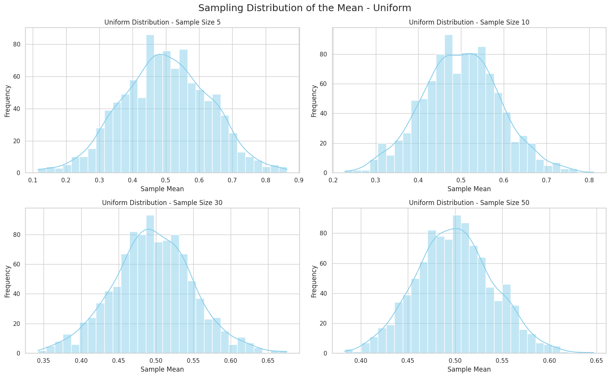

# Problem 1

# 🧪 Central Limit Theorem (CLT) – Simulation and Explanation

## 🧠 What is the Central Limit Theorem?

The **Central Limit Theorem (CLT)** states:

> If we take many random samples from any population, the means of those samples will form a **normal distribution** as the sample size increases.

---

## 📚 Key Definitions

### 1. **Population**
The full set of data we want to study.

### 2. **Sample**
A smaller part taken from the population.

### 3. **Sample Mean**

If the sample values are:

$$
x_1, x_2, \dots, x_n
$$

Then the sample mean is:

$$
\bar{x} = \frac{x_1 + x_2 + \dots + x_n}{n}
$$

### 4. **Sampling Distribution**
The distribution of sample means from many random samples.

### 5. **Normal Distribution**
The classic "bell curve" that is symmetric around the mean.

---

## 🔍 Goal of the Simulation

- Show how sample means become normally distributed.
- Use different population types: `Uniform`, `Exponential`, `Binomial`.
- Explore how **sample size** affects the shape of the sampling distribution.

---

##  Simulation Steps

1. Create three population types (10,000 values each):
   - **Uniform**: all values are equally likely.
   - **Exponential**: many small values, few large ones.
   - **Binomial**: success/failure (0 or 1 outcomes).

2. Take random samples of sizes:
   - $$n = 5, 10, 30, 50$$
   - Repeat 1,000 times, calculate the mean each time.

3. Plot histograms of the sample means.

---

## 📊 Expected Results (Graph Interpretation)

- For **small sample sizes** (e.g., **5**), the shape of the sampling distribution is **irregular** and often reflects the shape of the original population.
- As the **sample size increases** (e.g., **30 or 50**), the distribution of the sample means becomes **more bell-shaped**, closely resembling a **normal distribution**.
- This behavior occurs **regardless of the shape of the original population distribution** (uniform, exponential, binomial, etc.).

---

## 💻 Python Simulation Code




[Visit My Colab](https://colab.research.google.com/drive/1earTz9fEE6AFTS9FfG3Pp4AjYf79A1Yw)

```python 
import numpy as np
import matplotlib.pyplot as plt
import seaborn as sns

sns.set(style="whitegrid")

uniform_population = np.random.uniform(0, 1, 10000)
exponential_population = np.random.exponential(1, 10000)
binomial_population = np.random.binomial(n=1, p=0.5, size=10000)

populations = {
    'Uniform': uniform_population,
    'Exponential': exponential_population,
    'Binomial': binomial_population
}

sample_sizes = [5, 10, 30, 50]

for name, population in populations.items():
    plt.figure(figsize=(16, 10))
    
    for i, size in enumerate(sample_sizes, 1):
        sample_means = []
        for _ in range(1000):
            sample = np.random.choice(population, size=size)
            sample_means.append(np.mean(sample))
        
        plt.subplot(2, 2, i)
        sns.histplot(sample_means, bins=30, kde=True, color="skyblue")
        plt.title(f"{name} Distribution - Sample Size {size}")
        plt.xlabel("Sample Mean")
        plt.ylabel("Frequency")
    
    plt.suptitle(f"Sampling Distribution of the Mean - {name}", fontsize=18)
    plt.tight_layout()
    plt.show()
```