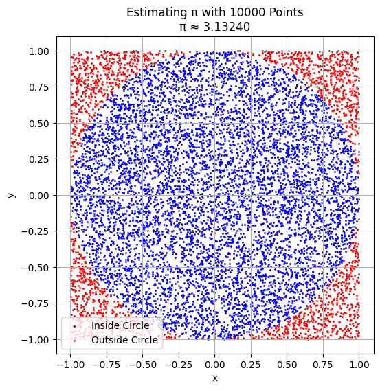
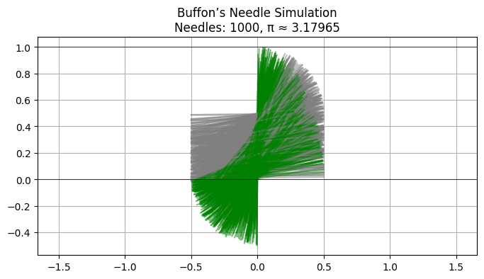
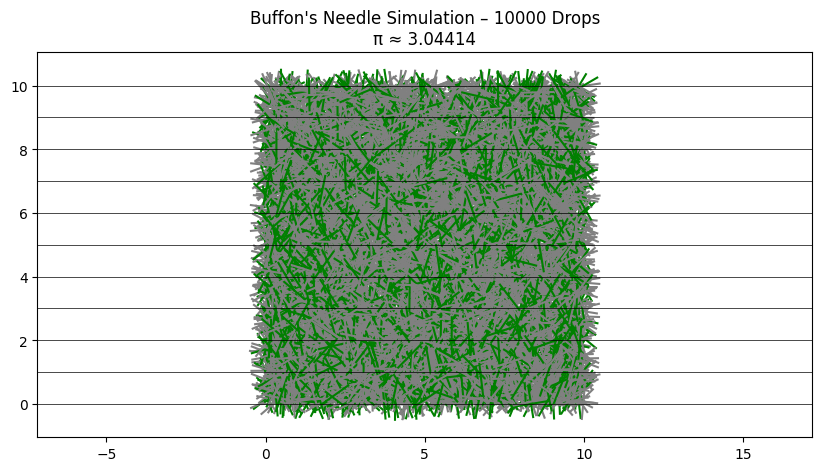

# Problem 2

# 🎯 Estimating π Using Monte Carlo Methods

## 📌 Motivation
Monte Carlo methods are powerful techniques that use random sampling to solve problems. One elegant application is estimating the value of π (pi).

We will explore two classic approaches:

- **Circle Method** — randomly generate points and use geometry to estimate π.  
- **Buffon’s Needle** — simulate dropping a needle and observe how often it crosses lines.

---

## 🟠 Method 1: Estimating π Using a Circle

### 🧠 Idea
- Place a unit circle inside a square.
- Generate many random points inside the square.
- Count how many points fall inside the circle.

### 📐 Formula

Let:  
- $N$ = total number of points  
- $C$ = number of points inside the circle  

Then the estimate is:

$$
\pi \approx 4 \cdot \frac{C}{N}
$$

---



[Visit My Colab](https://colab.research.google.com/drive/1wzR9-shpl1GaV1ESJZRN8SpH_dGr9rLZ)

``` python
import numpy as np
import matplotlib.pyplot as plt

def estimate_pi(num_points):
    x = np.random.uniform(-1, 1, num_points)
    y = np.random.uniform(-1, 1, num_points)
    inside = x**2 + y**2 <= 1
    pi_estimate = 4 * np.sum(inside) / num_points
    
    # Plotting
    plt.figure(figsize=(6, 6))
    plt.scatter(x[inside], y[inside], color='blue', s=1, label='Inside Circle')
    plt.scatter(x[~inside], y[~inside], color='red', s=1, label='Outside Circle')
    plt.title(f'Estimating π with {num_points} Points\nπ ≈ {pi_estimate:.5f}')
    plt.xlabel('x')
    plt.ylabel('y')
    plt.legend()
    plt.axis('square')
    plt.grid(True)
    plt.show()
    
    return pi_estimate

# Example run
estimate_pi(10000)
```

## 📊 Expected Results

For small samples (e.g., 100 points), the estimate may be inaccurate.

As the number of points increases (10,000 or more), the plot shows a clear circle, and the π estimate becomes more accurate.

---

## 🪡 Method 2: Estimating π Using Buffon’s Needle

### 🧠 Idea
- Drop a needle on a floor with parallel lines.
- If the needle crosses a line, we count it.
- The chance of crossing is related to π.

### 📐 Formula

Let:  
- $N$ = number of needle drops  
- $C$ = number of times the needle crosses a line  

If needle length equals the distance between lines, then:

$$
\pi \approx \frac{2 \cdot N}{C}
$$



[Visit My Colab](https://colab.research.google.com/drive/1UL63E_sugvyVTgKA45p1IqCawI1OIV6s)

``` python
import numpy as np
import matplotlib.pyplot as plt

def estimate_pi_buffon(num_needles):
    length = 1.0      # Needle length
    spacing = 1.0     # Line spacing
    crosses = 0
    x_start = []
    y_start = []
    x_end = []
    y_end = []
    cross_flags = []

    for _ in range(num_needles):
        y_center = np.random.uniform(0, spacing / 2)
        angle = np.random.uniform(0, np.pi / 2)
        y_proj = (length / 2) * np.sin(angle)

        if y_proj >= y_center:
            crosses += 1
            cross_flags.append(True)
        else:
            cross_flags.append(False)

        x0 = 0
        y0 = y_center
        x1 = (length / 2) * np.cos(angle)
        y1 = (length / 2) * np.sin(angle)

        x_start.append(x0 - x1)
        y_start.append(y0 - y1)
        x_end.append(x0 + x1)
        y_end.append(y0 + y1)

    if crosses == 0:
        pi_est = None
        print("No crosses occurred — try more drops.")
    else:
        pi_est = (2 * num_needles) / crosses

    # Plotting
    plt.figure(figsize=(8, 4))
    for i in range(num_needles):
        color = 'green' if cross_flags[i] else 'gray'
        plt.plot([x_start[i], x_end[i]], [y_start[i], y_end[i]], color=color, alpha=0.5)

    for y in np.arange(0, spacing * 2, spacing):
        plt.axhline(y=y, color='black', linewidth=0.5)

    plt.title(f"Buffon’s Needle Simulation\nNeedles: {num_needles}, π ≈ {pi_est:.5f}" if pi_est else "No estimate")
    plt.axis('equal')
    plt.grid(True)
    plt.show()

    return pi_est

# Example run
estimate_pi_buffon(1000)
```


[Visit My Colab](https://colab.research.google.com/drive/1Q4eOLQNkCld5lB9VcH1Fyj0SBXYK8mIx)

``` python
import numpy as np
import matplotlib.pyplot as plt

def buffon_pi(num_drops, L=1.0, D=2.0):
    hits = 0
    x_positions = []
    angles = []
    crosses = []
    
    for _ in range(num_drops):
        x = np.random.uniform(0, D / 2)  # distance from center to nearest line
        theta = np.random.uniform(0, np.pi)  # angle in radians
        if x <= (L / 2) * np.sin(theta):
            hits += 1
            crosses.append(True)
        else:
            crosses.append(False)
        x_positions.append(x)
        angles.append(theta)
    
    pi_estimate = (2 * L * num_drops) / (D * hits) if hits != 0 else 0

    # Visualization
    plt.figure(figsize=(10, 5))
    for i in range(num_drops):
        x0 = np.random.uniform(0, 10)
        y0 = np.random.uniform(0, 10)
        dx = (L / 2) * np.cos(angles[i])
        dy = (L / 2) * np.sin(angles[i])
        color = 'green' if crosses[i] else 'gray'
        plt.plot([x0 - dx, x0 + dx], [y0 - dy, y0 + dy], color=color)
    
    for i in range(0, 11):
        plt.axhline(i, color='black', linewidth=0.5)
    
    plt.title(f"Buffon's Needle Simulation – {num_drops} Drops\nπ ≈ {pi_estimate:.5f}")
    plt.axis('equal')
    plt.show()

    return pi_estimate

# Example run
buffon_pi(10000)
```

In Buffon’s Needle, green lines cross a black line (a “hit”), while gray lines miss. More drops = better π estimate.

## 📊 What You'll See

- **Gray needles** = did not cross a line.  
- **Green needles** = crossed a line.  
- **Horizontal black lines** = simulate the floor lines.  

You will get a visual and numerical estimate of π.

---

## 📈 Convergence & Comparison

| Method            | Description                        | Formula                            | Convergence Speed        |
|-------------------|------------------------------------|-------------------------------------|---------------------------|
| Circle Method     | Random points in square + circle   | $\pi \approx 4 \cdot \frac{C}{N}$  | Fast and accurate         |
| Buffon’s Needle   | Needle crossing parallel lines     | $\pi \approx \frac{2 \cdot N}{C}$  | Slower, more variable     |

---

## ✅ Summary

- **Circle method** is simple and converges faster.  
- **Buffon’s needle** is more classical and geometric.  
- Both show how randomness helps estimate π.  
- As the number of trials increases, estimates get closer to the true value.
