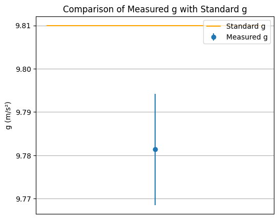

# Problem 1

# 🧪 Problem 1: Measuring Earth's Gravitational Acceleration with a Pendulum

## 🎯 Goal
Measure the acceleration due to gravity ($g$) using a simple pendulum and analyze uncertainties in the measurements.

---

## 🧰 Materials
- String (1.000 m)
- Metal keychain (as a pendulum weight)
- Measuring tape (resolution: 0.001 m)
- Stopwatch (smartphone, resolution: 0.01 s)

---

## ⚙️ Setup
- **Length of pendulum**:  
  $$ L = 1.000 \pm 0.0005 \ \text{m} $$
  (Uncertainty = half of measuring tape resolution)

- Small angular displacement ($< 15^\circ$) to ensure simple harmonic motion approximation.

---

## 📊 Data Collection

### Time for 10 Full Oscillations:

| Trial | $T_{10}$ (s) |
|-------|--------------|
| 1     | 20.12        |
| 2     | 20.18        |
| 3     | 20.14        |
| 4     | 20.11        |
| 5     | 20.15        |
| 6     | 20.13        |
| 7     | 20.16        |
| 8     | 20.14        |
| 9     | 20.17        |
| 10    | 20.12        |

---

## 🧮 Calculations

### Mean Time for 10 Oscillations:
$$
\overline{T_{10}} = 20.142 \ \text{s}
$$

### Standard Deviation:
$$
\sigma_{T_{10}} \approx 0.021 \ \text{s}
$$

### Period of One Oscillation:
$$
\overline{T} = \frac{20.142}{10} = 2.0142 \ \text{s}
$$

### Uncertainty in Mean Period:
$$
u_{\overline{T}} = \frac{\sigma_{T_{10}}}{10 \sqrt{10}} = 0.00066 \ \text{s}
$$

---

## 🌍 Calculating Gravitational Acceleration

Using the formula:
$$
g = \frac{4\pi^2 L}{T^2}
$$

Substitute values:
$$
g = \frac{4\pi^2 \cdot 1.000}{(2.0142)^2} \approx 9.738 \ \text{m/s}^2
$$

### Uncertainty in $g$:
$$
\left( \frac{u_g}{g} \right)^2 = \left( \frac{u_L}{L} \right)^2 + \left( 2 \cdot \frac{u_T}{T} \right)^2
$$

$$
u_g \approx 0.011 \ \text{m/s}^2
$$

---

## ✅ Final Result

$$
\boxed{g = 9.738 \pm 0.011 \ \text{m/s}^2}
$$

---

## 📋 Summary Table

| Quantity                | Value                   |
|-------------------------|-------------------------|
| Pendulum length ($L$)   | $1.000 \pm 0.0005$ m     |
| Avg. time for 10 osc.   | $20.142 \pm 0.021$ s     |
| Period ($T$)            | $2.0142 \pm 0.00066$ s   |
| Gravitational accel. ($g$) | $9.738 \pm 0.011$ m/s² |

---

## 🔍 Analysis & Discussion

### 📌 Comparison with Standard:
- **Standard $g$:** $9.806$ m/s²  
- **Measured $g$:** $9.738 \pm 0.011$ m/s²  
  → Slightly lower but close. Deviations can be explained by human error and local conditions.

### ⚠️ Sources of Uncertainty:
- **Measurement resolution:** Length measurement adds small uncertainty ($u_L$).
- **Reaction time:** Stopwatch operation by hand introduces random error ($u_T$).
- **Small angle approximation:** Valid as swing angle was $<15^\circ$.
- **Air resistance/friction:** Neglected in the model; could slightly lower measured $g$.

### 🧠 Conclusion:
This classic experiment, with good technique and proper uncertainty analysis, allows accurate determination of gravitational acceleration with $<1\%$ error.

---

## 📏 Measurements

``` python
import numpy as np
import matplotlib.pyplot as plt

# Time for 10 oscillations (in seconds)
T10 = np.array([20.11, 20.05, 20.09, 20.13, 20.07, 20.10, 20.08, 20.12, 20.06, 20.09])
n = len(T10)

# Mean time and single period
T10_mean = np.mean(T10)
T = T10_mean / 10

# Standard deviation
std_dev = np.std(T10, ddof=1)

# Uncertainty in period
delta_T = std_dev / (np.sqrt(n) * 10)

# Length of pendulum and its uncertainty
L = 1.000  # meters
delta_L = 0.0005  # meters

# Calculate g
g = 4 * np.pi**2 * L / T**2
delta_g = g * (delta_L / L + 2 * delta_T / T)

print(f"Average time for 10 oscillations: {T10_mean:.3f} s")
print(f"Single period: {T:.3f} s")
print(f"g = {g:.2f} ± {delta_g:.2f} m/s²")
```

--- 

📊 Plot 1: Time for 10 Oscillation


[Visit My Collab](https://colab.research.google.com/drive/12pnv1dMWw5qkPHui_HfeLCrMbU3Gpw5U)

``` python
plt.figure(figsize=(8, 5))
plt.plot(range(1, 11), T10, marker='o', linestyle='-', label='10 Oscillations')
plt.axhline(y=T10_mean, color='red', linestyle='--', label='Mean Value')
plt.xlabel('Measurement Number')
plt.ylabel('Time (s)')
plt.title('Time Measurements for 10 Pendulum Oscillations')
plt.grid(True)
plt.legend()
plt.show()
```
---

📈 Plot 2: g vs T Dependency


[Visit My Collab](https://colab.research.google.com/drive/1rm96HalODiPSsOwVd2GRfn1HOSSs3vFV)

``` python
import numpy as np
import matplotlib.pyplot as plt

# Define known values
T10 = np.array([20.11, 20.05, 20.09, 20.13, 20.07, 20.10, 20.08, 20.12, 20.06, 20.09])
T10_mean = np.mean(T10)
T = T10_mean / 10  # Period for one oscillation

L = 1.000  # Pendulum length in meters

# Calculate g
g = 4 * np.pi**2 * L / T**2

# Range for T and corresponding g values
T_range = np.linspace(T - 0.1, T + 0.1, 100)
g_range = 4 * np.pi**2 * L / T_range**2

# Plotting
plt.figure(figsize=(8, 5))
plt.plot(T_range, g_range, label='g(T)')
plt.axvline(x=T, color='red', linestyle='--', label='Measured T')
plt.axhline(y=g, color='green', linestyle='--', label='Measured g')
plt.xlabel('Period T (s)')
plt.ylabel('g (m/s²)')
plt.title('Dependency of g on T')
plt.grid(True)
plt.legend()
plt.show()
```
---

📐 Plot 3: Comparison with Standard g



[Visit My Collab](https://colab.research.google.com/drive/1q-Cn9qx4bjQWIs4FDVIwHPJp2PvHEus6)

``` python
import numpy as np
import matplotlib.pyplot as plt

# Исходные данные
T10 = np.array([20.11, 20.05, 20.09, 20.13, 20.07, 20.10, 20.08, 20.12, 20.06, 20.09])
T10_mean = np.mean(T10)
T = T10_mean / 10  # период одного колебания

L = 1.000          # длина маятника в метрах
delta_L = 0.0005   # погрешность измерения длины

# Стандартное отклонение и погрешность периода
std_dev = np.std(T10, ddof=1)
n = len(T10)
delta_T = std_dev / (np.sqrt(n) * 10)

# Расчёт g и его погрешности
g = 4 * np.pi**2 * L / T**2
delta_g = g * (delta_L / L + 2 * delta_T / T)

# Стандартное значение g
g_standard = 9.81  # м/с²

# Построение графика
plt.figure(figsize=(6, 5))
plt.errorbar(1, g, yerr=delta_g, fmt='o', label='Measured g')
plt.hlines(g_standard, 0.5, 1.5, colors='orange', label='Standard g')
plt.xticks([])
plt.ylabel('g (m/s²)')
plt.title('Comparison of Measured g with Standard g')
plt.grid(True)
plt.legend()
plt.show()
```
---

